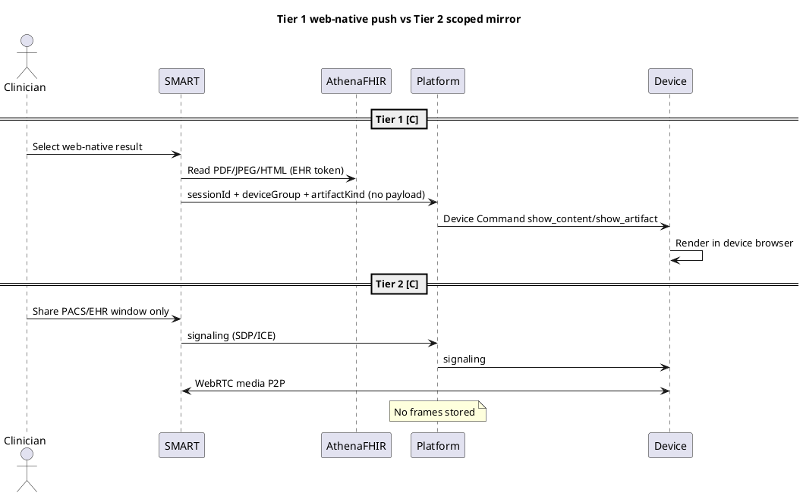

# Imaging In-Scope SAD Chapters (19–20) + ADR-019 Implementation Plan

> **For agentic workers:** REQUIRED SUB-SKILL: Use superpowers:subagent-driven-development (recommended) or superpowers:executing-plans to implement this plan task-by-task. Steps use checkbox (`- [ ]`) syntax for tracking.

**Goal:** Put exam-room imaging display + HITL imaging evidence into the SAD as **delivery architecture**, with ADR-019 superseding ADR-009, rewritten DNB-9, NFR updates, and diagrams 23–25.

**Architecture:** Do not paste `customer-kb` prebuild 08/09. Restate the vision: zero PHI/pixels on Mesmerize servers; FHIR token in browser; server-mediated devices; no Mesmerize DICOM viewer; Tier 1 web-native push + Tier 2 scoped WebRTC P2P; athena HITL DocumentReference. Rewrite ADRs in place — never delete ADR files.

**Tech Stack:** Markdown SAD chapters, PlantUML C4 + sequence, OpenJDK + `.tools/plantuml.jar`.

**Spec:** `docs/superpowers/specs/2026-08-19-imaging-in-scope-sad-chapters-design.md`

## Global Constraints

- Catalog IDs: `23-imaging-evidence-capture-writeback`, `24-imaging-mirror-transport`, `25-imaging-tier1-tier2-sequence` only (19/20 PNGs already mean CI/CD ladders).
- No Mesmerize DICOM viewer, no WADO-RS ingest, no `ImagingStudy` v1 path, no imaging bytes in RDS/S3/logs.
- SMART never talks to devices; WebRTC **media** is P2P; Platform **signaling + Device Command** only.
- Do not invent numeric SLOs, Region, CIDR, or exact athena sandbox scope strings as Confirmed (Proposed + Ch.18 Q-16).
- Four-EHR Observation/Provenance / eCW HL7 = **roadmap**, not v1.
- `customer-kb/INFRASTRUCTURE.md` device transport remains **open** — cite ADR-019 as this pack’s decision, not customer `D-xx`.
- Do **not** `git rm` ADR-001–018.
- Mirror PUML/PNG under `output_docs/output_diagrams/`.
- Commit steps: only if the user requested commits this session; otherwise skip.

## File map

| Path | Responsibility |
|------|----------------|
| `docs/adr/019-exam-room-imaging-display-and-evidence.md` | New ADR |
| `docs/adr/009-dicom-imaging-out-of-sow-scope.md` | Superseded rewrite |
| `docs/adr/011-do-not-build.md` | DNB-9 rewrite |
| `docs/adr/005-smart-oauth-ehr-launch-mvp-scopes.md` | Additive read scopes |
| `docs/adr/README.md` | #20, DNB-9, index 019 |
| `output_diagrams/23-*.{puml,png}` | Ch.19 Figure 19-1 |
| `output_diagrams/24-*.{puml,png}` | Ch.20 Figure 20-1 |
| `output_diagrams/25-*.{puml,png}` | Ch.20 Figure 20-2 |
| `output_docs/sad/chapters/19-imaging-mirror-evidence-addendum.md` | Evidence pointer chapter |
| `output_docs/sad/chapters/20-exam-room-imaging-mirror.md` | Architecture chapter |
| SAD Ch.01, 02, 03, 05, 06, 07, 08, 09, 10, 12, 14, 15, 16, 18 | Ripple |
| `docs/ai/NFR.md` + `output_docs/nfr/*` | PERF-02, INT-05, ASR |
| `AGENTS.md`, `docs/ai/{ARCHITECTURE,PROJECT_CONTEXT,ENGINEERING_RULES,TESTING,GLOSSARY,SECURITY,CURRENT_STATE}.md` | Agent docs |
| SAD README, COVERAGE, PROGRESS | Pack index |

**Render command:**

```bash
export PATH="/opt/homebrew/opt/openjdk/bin:$PATH"
cd /Users/sasaaleksandrov/mesmerize
java -jar .tools/plantuml.jar -tpng -o "$(pwd)/output_diagrams" output_diagrams/23-imaging-evidence-capture-writeback.puml
java -jar .tools/plantuml.jar -tpng -o "$(pwd)/output_diagrams" output_diagrams/24-imaging-mirror-transport.puml
java -jar .tools/plantuml.jar -tpng -o "$(pwd)/output_diagrams" output_diagrams/25-imaging-tier1-tier2-sequence.puml
# If @startuml id ≠ filename, mv PNG to the catalog basename
cp -f output_diagrams/23-imaging-evidence-capture-writeback.{puml,png} output_docs/output_diagrams/
cp -f output_diagrams/24-imaging-mirror-transport.{puml,png} output_docs/output_diagrams/
cp -f output_diagrams/25-imaging-tier1-tier2-sequence.{puml,png} output_docs/output_diagrams/
file output_diagrams/23-imaging-evidence-capture-writeback.png output_diagrams/24-imaging-mirror-transport.png output_diagrams/25-imaging-tier1-tier2-sequence.png
```

---

### Task 1: ADR-019 + supersede 009 + rewrite DNB-9 and ADR-005

**Files:**
- Create: `docs/adr/019-exam-room-imaging-display-and-evidence.md`
- Modify: `docs/adr/009-dicom-imaging-out-of-sow-scope.md`
- Modify: `docs/adr/011-do-not-build.md`
- Modify: `docs/adr/005-smart-oauth-ehr-launch-mvp-scopes.md` (decision 6 + scope list)
- Modify: `docs/adr/README.md` (#20, DNB-9, ADR index)
- Mirror: `cp` those files to `output_docs/docs/adr/`

**Interfaces:**
- Produces: Binding text later chapters must cite as ADR-019
- Consumes: Spec locked decisions

- [ ] **Step 1: Write ADR-019** with Status Accepted; Date 2026-08-19; Supersedes ADR-009; Amends 005, 011 DNB-9. Include the four decision bullets from the spec (Tier 1, Tier 2, evidence `imaging_session` conceptual name, forbidden list). State signaling is this pack’s decision, not `INFRASTRUCTURE.md` D-xx.

- [ ] **Step 2: Rewrite ADR-009** header Status: **Superseded by [ADR-019](019-exam-room-imaging-display-and-evidence.md)**. Keep original SOW-exclusion as **historical Context**. New Decision section: do not implement Mesmerize DICOM viewer / WADO ingest / server-side imaging payloads; display+evidence rules live in 019.

- [ ] **Step 3: Rewrite DNB-9** to: **No Mesmerize DICOM viewer and no server-side DICOM or imaging payloads.** Reason: PHI/FDA; imaging **display** is in scope per ADR-019. Update ADR-011 sources line to include 019.

- [ ] **Step 4: Amend ADR-005** decision 5 with **Proposed** additive reads (tag Proposed in SAD, Confirmed-as-intent in ADR): `patient/DiagnosticReport.read`, `patient/DocumentReference.read`, `patient/Media.read`, `patient/Observation.read` (labs/reports). Keep existing write `DocumentReference.write`. Replace decision 6 with: do **not** add `ImagingStudy` / DICOMweb / WADO to v1 (ADR-019). Keep Patient.read (browser-only; still not sent to Platform).

- [ ] **Step 5: Update ADR README** decision #20 to imaging in-scope Tier 1+2 / no DICOM viewer / ADR-019. DNB-9 row same. Index row for 019. Do not remove 009 from the index (mark superseded in title).

- [ ] **Step 6: Verify** `rg -n "out of current SOW scope" docs/adr/009-dicom-imaging-out-of-sow-scope.md` appears only in historical context, not as live Decision. `rg "019-exam-room" docs/adr/README.md` matches.

- [ ] **Step 7: Mirror** `mkdir -p output_docs/docs/adr && cp -f docs/adr/005-*.md docs/adr/009-*.md docs/adr/011-*.md docs/adr/019-*.md docs/adr/README.md output_docs/docs/adr/`

- [ ] **Step 8: Commit (only if requested)** `docs(adr): supersede ADR-009 with imaging-in-scope ADR-019`

---

### Task 2: Diagram 23 — evidence capture vs writeback (Ch.19)

**Files:**
- Create: `output_diagrams/23-imaging-evidence-capture-writeback.puml` (+ PNG)
- Mirror under `output_docs/output_diagrams/`

**Interfaces:**
- Produces: Figure 19-1

- [ ] **Step 1: Write PlantUML** exactly (C4 + evidence tags):

```plantuml
@startuml 23-imaging-evidence-capture-writeback
!include https://raw.githubusercontent.com/plantuml-stdlib/C4-PlantUML/master/C4_Container.puml
title Imaging evidence — capture vs HITL writeback (athena v1)\n[C]=Confirmed [I]=Inferred [P]=Proposed · no pixels on Platform
LAYOUT_WITH_LEGEND()
Person(clinician, "Clinician [C]", "SMART iframe")
System_Ext(athena, "athenahealth FHIR [C]", "Token stays in browser")
System_Boundary(mz, "Mesmerize") {
  Container(smart, "SMART Web App [C]", "React + fhirclient.js", "Reads artifacts in browser; HITL UI")
  Container(api, "Platform API [C]", "Python/FastAPI", "imaging_session metadata only")
  ContainerDb(pg, "Postgres [C]", "RDS", "session + device + timestamps + tier/type · no PHI")
}
Container(device, "Exam-room PWA [C]", "Display", "Shows artifact or mirror · no EHR token from server")
Rel(clinician, smart, "Approve evidence", "HITL [C]")
Rel(smart, athena, "Read web-native artifacts / write DocumentReference", "EHR token [C]")
Rel(smart, api, "Create imaging_session", "ICD-10? no · sessionId + deviceGroup + kind [C]")
Rel(api, pg, "Store de-identified event", "no pixels [C]")
Rel(smart, device, "Never direct", "forbidden [C]")
Rel(api, device, "Command / signaling only", "ADR-007/019 [C]")
note as N1
  SoR = Platform store.
  Missing writeback does not drop evidence [C].
end note
@enduml
```

- [ ] **Step 2: Render + mirror** using Global Constraints render command for 23. Rename PNG if PlantUML uses `@startuml` id as filename.

- [ ] **Step 3: Verify** `file` reports PNG; image is not a PlantUML error page (no giant “syntax error” raster).

- [ ] **Step 4: Commit (only if requested)** `docs(diagrams): add imaging evidence flow 23`

---

### Task 3: Diagrams 24 + 25 — transport + sequences (Ch.20)

**Files:**
- Create: `output_diagrams/24-imaging-mirror-transport.puml` (+ PNG)
- Create: `output_diagrams/25-imaging-tier1-tier2-sequence.puml` (+ PNG)
- Mirror both

**Interfaces:**
- Produces: Figures 20-1 and 20-2

- [ ] **Step 1: Write 24** C4 containers: clinician, SMART, Platform (command + signaling), exam-room PWA, athena FHIR (browser-only Rel from SMART), dashed Rel SMART↔device labeled `WebRTC P2P media [C] · no Platform media`. Optional note: `Cornerstone/OHIF = rejected [C]`. No Netlify/TTV. Python/FastAPI not NestJS.

- [ ] **Step 2: Write 25** as two `group` sequences in one `@startuml`:
  - **Tier 1:** SMART → athena FHIR read (browser) → Platform `show_artifact` metadata → device render
  - **Tier 2:** SMART `getDisplayMedia` (window/tab only) → signaling via Platform → WebRTC P2P → device display
  - Failures in a note: unpaired, signaling drop, wrong-window, HITL reject — never S3 pixel retry

Example 25 skeleton (expand, do not omit groups):



- [ ] **Step 3: Render + mirror** 24 and 25.

- [ ] **Step 4: Verify** both PNGs via `file`.

- [ ] **Step 5: Update** `output_diagrams/README.md` and `output_docs/output_diagrams/README.md` with rows 23, 24, 25. Extend regenerate note to include 23–25.

- [ ] **Step 6: Commit (only if requested)** `docs(diagrams): add imaging transport 24 and sequences 25`

---

### Task 4: SAD Chapter 19

**Files:**
- Create: `output_docs/sad/chapters/19-imaging-mirror-evidence-addendum.md`

**Interfaces:**
- Consumes: ADR-019, diagram 23
- Produces: Figure 19-1 embed path `../../output_diagrams/23-imaging-evidence-capture-writeback.png`

- [ ] **Step 1: Create chapter** using the same YAML-ish field table as Ch.18 (Chapter ID `19-imaging-mirror-evidence-addendum`, SAD mapping extension/appendix, Last updated 2026-08-19, Maturity Review-ready). Sections: Purpose, Narrative, Diagram, Evidence, White spots, Open questions → Ch.18 **Q-16**.

Narrative **must** include:
- Taxonomy: imaging_session vs content engagement (de-identified)
- Capture universal; Platform SoR; HITL DocumentReference athena v1
- Pointers to Confluence MESENG addendum and `customer-kb/docs/prebuild-proposal/08-IMAGING-MIRROR-EVIDENCE-ADDENDUM.md` as **non-canonical**
- MESV2-213–217 listed as traceability; v1 **does not** implement 213 Observation/Provenance or 217 eCW HL7
- Colored Confirmed/Proposed/Unknown callouts (HTML same as other chapters)

- [ ] **Step 2: Embed** Figure 19-1 with caption: no pixels on Platform.

- [ ] **Step 3: Verify** `test -f output_docs/output_diagrams/23-imaging-evidence-capture-writeback.png` and relative link from chapter resolves.

- [ ] **Step 4: Commit (only if requested)** `docs(sad): add Chapter 19 imaging evidence addendum`

---

### Task 5: SAD Chapter 20

**Files:**
- Create: `output_docs/sad/chapters/20-exam-room-imaging-mirror.md`

**Interfaces:**
- Consumes: ADR-019, diagrams 24 and 25
- Produces: Figures 20-1 and 20-2

- [ ] **Step 1: Create chapter** (Chapter ID `20-exam-room-imaging-mirror`). Sections: Purpose, Narrative, Diagrams, Evidence, White spots, Open questions → Q-16 plus note that customer device-transport `D-xx` is still open.

Narrative **must** include:
- Five data-type table (report, labs, scanned docs, photos, raw DICOM) — last row not rendered by us
- P1–P4 mapped to ADR-002/007/019
- Tier 1 and Tier 2 sequences in prose matching diagram 25
- Tier 3 Cornerstone = rejected
- Errors: unpaired device, signaling drop, wrong-window share, HITL reject — never S3 pixel retry
- Testing: synthetic PDFs/JPEGs; no real PHI
- Explicit: WebRTC/signaling per ADR-019, **not** claimed as `INFRASTRUCTURE.md` D-xx

- [ ] **Step 2: Embed both PNGs** with captions.

- [ ] **Step 3: Verify** both image files exist and chapter has two `![` image embeds.

- [ ] **Step 4: Commit (only if requested)** `docs(sad): add Chapter 20 exam-room imaging architecture`

---

### Task 6: Ripple SAD chapters + pack index

**Files:**
- Modify: `output_docs/sad/chapters/01-purpose.md` (guardrail bullet: honor DNB + ADR-019, not “imaging-out-of-SOW”)
- Modify: `output_docs/sad/chapters/02-scope.md` (in-scope imaging Tier 1+2; out-of-scope = DICOM viewer/WADO/server payloads, not all imaging)
- Modify: `output_docs/sad/chapters/03-related-documents.md` (009 superseded; 019; Ch.19–20)
- Modify: `output_docs/sad/chapters/05-business-context.md` (imaging to screens in-scope per 019; DICOM viewer still out)
- Modify: `output_docs/sad/chapters/06-solution-scope.md` (same in/out table)
- Modify: `output_docs/sad/chapters/07-functional-architecture.md` (optional imaging steps; scopes per 005/019)
- Modify: `output_docs/sad/chapters/08-system-architecture.md` (signaling; no media on API)
- Modify: `output_docs/sad/chapters/09-data-architecture.md` (forbidden payloads stay; allowed imaging **metadata**)
- Modify: `output_docs/sad/chapters/10-security-and-privacy.md` (scoped getDisplayMedia; P2P; ADR-019 not 009 for scopes)
- Modify: `output_docs/sad/chapters/12-messaging-and-integration.md` (signaling ≠ SQS hot path)
- Modify: `output_docs/sad/chapters/14-nfr-and-quality-attributes.md` (PERF-02 + INT-05)
- Modify: `output_docs/sad/chapters/15-key-terms-and-abbreviations.md`
- Modify: `output_docs/sad/chapters/16-revision-history.md` (new row 2026-08-19 Ch.19–20 / ADR-019)
- Modify: `output_docs/sad/chapters/18-assumptions-and-open-questions.md` (**Q-16**: ratify additive FHIR **read** scope strings with athena; A-row optional if needed)
- Modify: `output_docs/sad/README.md` (chapter index 19–20; honor ADR-019)
- Modify: `output_docs/sad/COVERAGE.md` (new sections 19 and 20; diagrams 23/24/25)
- Modify: `output_docs/sad/PROGRESS.md` (rows for 19–20; recount chapter totals)

- [ ] **Step 1: Apply** the replacements above. Search remaining live claims: `rg -n "imaging out of SOW|out of current SOW scope" output_docs/sad docs/adr` — leftover only in ADR-009 historical context.

- [ ] **Step 2: Verify** Ch.02 out-of-scope still lists DICOM **viewer** / WADO / server payloads; in-scope lists Tier 1+2.

- [ ] **Step 3: Commit (only if requested)** `docs(sad): align chapters 01–18 with imaging in-scope`

---

### Task 7: NFR + ASR + agent docs

**Files:**
- Modify: `docs/ai/NFR.md` — NFR-PERF-02: qualitative device display/mirror latency; Status Confirmed (in scope); Traceability ADR-019. Add **NFR-INT-05** ASR Yes Must: imaging display server-mediated; no DICOM viewer; no imaging payloads on servers; EHR token in browser (ADR-019, ADR-002, ADR-007).
- Modify: `output_docs/nfr/NFR_CATALOG.md` (same rows)
- Modify: `output_docs/nfr/ASR_CHECKLIST.md` — add NFR-INT-05 and “no imaging payloads on servers”
- Modify: `AGENTS.md` — invariant: imaging per 019; still no DICOM viewer; DNB-9 wording; in/out of scope line
- Modify: `docs/ai/ARCHITECTURE.md`, `PROJECT_CONTEXT.md`, `ENGINEERING_RULES.md`, `TESTING.md`, `GLOSSARY.md`, `SECURITY.md` (payloads still forbidden), `CURRENT_STATE.md` (imaging in-scope, not yet implemented; `packages/webrtc` = signaling/P2P client, not DICOM)

- [ ] **Step 1: Apply** NFR + ASR + agent doc edits. ENGINEERING_RULES “Don’t implement DICOM push” → “Don’t implement DICOM viewer / WADO ingest / server payloads.”

- [ ] **Step 2: Verify** `rg -n "out of SOW" docs/ai/NFR.md docs/ai/GLOSSARY.md AGENTS.md` has no live imaging-OOS claim. `rg "NFR-INT-05" docs/ai/NFR.md output_docs/nfr/NFR_CATALOG.md` matches.

- [ ] **Step 3: Commit (only if requested)** `docs(nfr): imaging INT-05 and PERF-02 in-scope`

---

## Spec coverage (self-review)

| Spec item | Task |
|-----------|------|
| ADR-019 new | 1 |
| 009 superseded not deleted | 1 |
| DNB-9 / 005 / README | 1 |
| Diagrams 23, 24, 25 + each chapter has diagram | 2, 3, 4, 5 |
| Ch.19 pointer + taxonomy | 4 |
| Ch.20 rewrite of 09 to our vision | 5 |
| Ripple SAD | 6 |
| NFR/ASR/AGENTS/ai docs | 7 |
| No four-EHR v1 adapters | 4, 5 |
| No invented SLOs | Global |
| customer-kb D-xx not claimed | 5 |

No TBD except conceptual event name `imaging_session` (allowed by spec).
