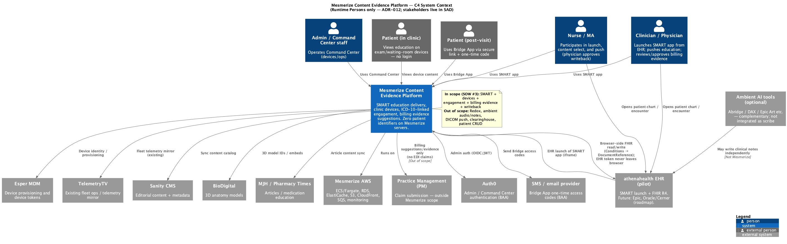

# 05. Business Context

| Field | Value |
|-------|-------|
| Chapter ID | `05-business-context` |
| SAD mapping | Template §5 Business Context (Business Objective, Expected Business Value, Key Stakeholders) |
| Last updated | 2026-07-23 |
| Maturity | Review-ready · 75% |

## Purpose of this chapter

State **why** Mesmerize is building the Content Evidence Platform, what business value the athenahealth pilot must prove, and **who owns governance** — kept separate from C4 runtime Persons ([ADR-012](../../../docs/adr/012-c4-persons-vs-stakeholders.md)).

## Business Objective

Deliver an **EHR-integrated Content Evidence Platform**: providers launch a SMART on FHIR app inside the EHR, push condition-specific patient education to exam-room / waiting-room devices, capture **timestamped, ICD-10-linked engagement**, and surface **billing-evidence suggestions** for physician review — with **minimal PHI footprint** (no patient identifiers on Mesmerize servers).

  <strong>Confirmed:</strong> Primary success metric — end-to-end <strong>athenahealth</strong> pilot with a real clinician by <strong>end of Q1 2027</strong>: SMART launch → Condition (ICD-10) read → content recommend → push to exam-room device → engagement capture → billing evidence → DocumentReference writeback — with <strong>no PHI/compliance incident</strong> (<code>docs/ai/PROJECT_CONTEXT.md</code>; SOW #3).

  <strong>Confirmed:</strong> Differentiation is <strong>content library + devices + engagement → billing evidence</strong>, not ambient scribing. Ambient documentation is saturated; earlier Redox / Deepgram / Claude SOAP paths are superseded (ADR-001; PROJECT_CONTEXT).

Supporting objectives from SOW #3 + Mesmerize Q&A:

1. **SMART on FHIR** education delivery (provider pushes relevant content).
2. **Foundation only** for future advanced features (e.g. imaging to screens) — DICOM push remains **out of scope**.
3. Pilot timing that supports **1,000+ screens** proof points for **July 2027** pharma planning.
4. **Avoid handling PHI** wherever possible.

## Expected Business Value

| Value | Description | Source |
|-------|-------------|--------|
| Practice adoption friction | Advertising-subsidized delivery (free / low friction) to clinics | PROJECT_CONTEXT business model |
| Condition-category ads | Ad targeting by condition **category** — not patient-level targeting | PROJECT_CONTEXT |
| Billable counseling evidence | Structured engagement + ICD-10 → CPT/HCPCS/HCC **suggestions** with human-in-the-loop approval | SOW #3; ADR-007/008 direction |
| Chart documentation | Optional browser-side FHIR DocumentReference writeback (engagement / service-delivery summary) | Decision #6 |
| Pharma planning proof | Pilot evidence for July 2027 advertiser / planning cycles | PROJECT_CONTEXT |
| Lower compliance cost | Zero patient IDs on Mesmerize servers; no ambient audio / note pipeline | ADR-001; ADR-011 |

  <strong>Confirmed:</strong> Business model pillars unchanged — advertising-subsidized delivery; Mesmerize / MJH / BioDigital content; Esper MDM fleet devices; Bridge App for post-visit / recurring-care engagement narrative.

  <strong>Inferred:</strong> “1,000+ screens” and July 2027 pharma timing are planning proof-points for commercial readiness — not an MVP device-count SLO for SOW #3 delivery acceptance.

## Key Stakeholders

Governance and ownership roles live in this table — **not** as C4 Person nodes unless they also operate a runtime product surface ([ADR-012](../../../docs/adr/012-c4-persons-vs-stakeholders.md)).

| Role | Who (as documented) | Notes |
|------|---------------------|-------|
| Exec sponsor / decision chain | MM (SVP), KN (Sr. Director); AM (CTO), BB (COO) support | Day-to-day: MM/KN |
| Technical owner | Andy Martin (CTO) | Platform / architecture ownership |
| Delivery partner | Newfire (SOW #3) | Builds SMART + Platform extensions per SOW |
| Athena relationship | Mesmerize (Marketplace Developer Console) | Pilot EHR marketplace |
| Content ownership | Mesmerize (Sanity + BioDigital + MJH) | Catalog + metadata |
| PWA ownership | Mesmerize (`MesmerizeTeam/touchscreen-ux`); Newfire **extends**, does not edit live production in place | Decision #7 |
| Compliance / PHI approver | **Open in kb** | Confirm named owner |
| Billing rules owner | **Open in kb** — Mesmerize consultant / partner; Newfire implements | Confirm named owner |
| Pharma / advertisers | Business consumers of aggregated engagement proof | Not MVP clinician login roles |

  <strong>Unknown:</strong> Named <strong>Compliance / PHI approver</strong> and <strong>Billing rules owner</strong> remain open in kb — do not invent owners.

## Open questions

Consolidated for Mesmerize decision-making in [Chapter 18 — Assumptions and Open Questions](18-assumptions-and-open-questions.md).

- **Q-01** — Compliance / PHI approver
- **Q-02** — Billing / engagement rules owner

### Runtime context (C4 Persons only)

The diagram below shows **runtime actors** who use a product surface (Clinician/Physician, Nurse/MA, Admin/Command Center, Patient in clinic, Patient post-visit). **Key stakeholders above are documented in the table — they are not C4 Person nodes.**

*Figure 5-1: C4 system context — runtime Persons and external systems only (`output_diagrams/07-c4-context`). Sponsors, delivery partners, content/compliance owners, and other Key Stakeholders are listed in the table above (ADR-012); they are not shown as C4 Persons.*

  <strong>Confirmed:</strong> C4 Persons = Clinician/Physician, Nurse/MA, Admin/Command Center staff, Patient (in clinic), Patient (post-visit / Bridge App). Stakeholders are SAD-only unless they also operate a runtime surface (ADR-012).

