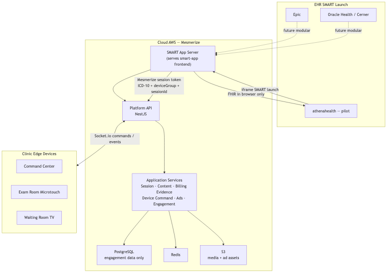
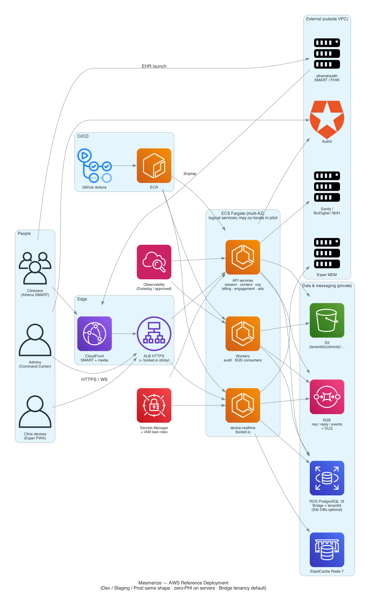

# 06. Solution Scope

| Field | Value |
|-------|-------|
| Chapter ID | `06-solution-scope` |
| SAD mapping | Template §6 Solution Scope (Solution Description, Solution Architecture Diagram) |
| Last updated | 2026-07-23 |
| Maturity | Draft · 80% |

## Purpose of this chapter

Define **what the Content Evidence Platform delivers under SOW #3** — and what it deliberately does not — so stakeholders share one boundary for pilot architecture, delivery, and do-not-build enforcement.

## Solution Description

### Product positioning

Mesmerize is building a **Content Evidence Platform**: EHR-launched SMART on FHIR education delivery, clinic device displays, ICD-10-linked engagement telemetry, and billing-evidence suggestions — with **zero patient identifiers on Mesmerize servers**.

  <strong>Confirmed:</strong> Build SMART app + device platform + engagement telemetry + billing suggestions. Do <strong>not</strong> capture audio, transcribe, or generate clinical notes in this program (ADR-001).

  <strong>Confirmed:</strong> <strong>athenahealth</strong> is the first pilot EHR; core Platform APIs and data models stay <strong>EHR-agnostic</strong> so Epic / Oracle Health are modular roadmap additions, not MVP rewrites (ADR-004).

### End-to-end pilot outcome (success boundary)

By **end of Q1 2027**, one athenahealth pilot org with a real clinician:

**SMART launch → Condition (ICD-10) read → content recommend → push to exam-room device → engagement capture → billing evidence → DocumentReference writeback** — with no PHI/compliance incident.

### In scope (SOW #3)

| Area | Included |
|------|----------|
| SMART on FHIR app | EHR launch inside athena; browser FHIR with EHR token |
| Content recommendation | ICD-10 → catalog metadata match (Sanity / BioDigital / MJH) |
| Device / PWA integration | Platform Device Command API → Socket.io; extend existing PWA patterns |
| Engagement capture | De-identified session telemetry (content, timestamps, duration, interactions) |
| Billing evidence | CPT/HCPCS/HCC **suggestions** + evidence; physician review/approve (HITL) |
| Rules engine | Site-configurable billing / content rules |
| Writeback | Browser-side FHIR **DocumentReference** (engagement / service-delivery summary) |
| Tenancy | Organization tenant; clinic sub-scope; pilot default **Bridge** |
| Pilot footprint | **One athenahealth** organization |
| Roadmap artifacts | EHR-agnostic core blueprint + Epic/Cerner integration **roadmap** (analysis, not full build) |

### Out of scope (explicit)

| Area | Excluded | Source |
|------|----------|--------|
| Ambient AI / audio | Capture, Deepgram transcription, Claude SOAP notes, transcript/clinical-note storage, recording consent | ADR-001; DNB-2–DNB-5 |
| Redox / server FHIR | Redox dependency; server-side EHR token or EHR API calls | DNB-1; DNB-8 |
| Patient record on Mesmerize | Patient CRUD / longitudinal patient store | DNB-6 |
| Claims / EDI | Clearinghouse or claim submission (PM system owns claims) | DNB-7 |
| DICOM / imaging mirror | DICOM push, Patient Imaging Mirror, screen mirroring UX | ADR-009; DNB-9 |
| ML recommender | If metadata insufficient — not in SOW #3 | PROJECT_CONTEXT / SOW #3 |
| Multi–health-system prod | Production rollout beyond single athena pilot org | SOW #3 |
| Epic / Cerner MVP build | Marketplace registration & full integrations — roadmap only | ADR-004 |

  <strong>Confirmed:</strong> DICOM push / imaging mirror / screen mirroring is <strong>out of current SOW scope</strong>; keep architectural awareness only — do not implement imaging scopes, DICOM pipelines, or mirroring UX under SOW #3 (ADR-009).

  <strong>Inferred:</strong> “Foundation for future” imaging / advanced features means design awareness and non-goals documentation — not delivery stubs that complete DNB items.

### Do-not-build summary (DNB-1–DNB-9)

Agents and delivery must reject: Redox; Deepgram; Claude SOAP; transcript storage; clinical note storage; patient CRUD; clearinghouse/EDI; server-side EHR tokens; DICOM push in current scope ([ADR-011](../../../docs/adr/011-do-not-build.md)).

## Solution Architecture Diagram

### System context (C4)

*Figure 6-1: System context — SMART app in EHR, Mesmerize Platform (no PHI), exam/waiting devices, Bridge, and external content/EHR boundaries (`output_diagrams/01-system-context`).*

  <strong>Confirmed:</strong> FHIR access token never leaves the browser; SMART never talks to devices directly; Platform receives ICD-10 + device group ID + opaque session ID only (hard invariants / ADR-002 family).

### Stakeholder AWS deployment overview

*Figure 6-2: Stakeholder AWS reference topology (multi-AZ shape for Dev/Staging/Prod) — CloudFront/ALB, ECS services, data stores, messaging (`output_diagrams/17-aws-deployment-reference`; ADR-015).*

  <strong>Proposed:</strong> Detailed production packaging, region/DR, and autoscaling knobs live in Chapter 13 / ADR-015 evidence — this chapter only establishes solution-boundary context for the AWS shape.

## Evidence

- [ADR-001](../../../docs/adr/001-content-evidence-not-ambient-scribe.md) — Content Evidence, not ambient scribe
- [ADR-004](../../../docs/adr/004-athena-pilot-ehr-agnostic-core.md) — athena pilot; EHR-agnostic core
- [ADR-009](../../../docs/adr/009-dicom-imaging-out-of-sow-scope.md) — DICOM / imaging out of SOW
- [ADR-011](../../../docs/adr/011-do-not-build.md) — DNB-1–DNB-9
- [`docs/ai/PROJECT_CONTEXT.md`](../../../docs/ai/PROJECT_CONTEXT.md) — in/out of scope, success metric
- `output_diagrams/01-system-context` · `output_diagrams/17-aws-deployment-reference`

## White spots

  <strong>Unknown:</strong> Exact pilot clinic/device count and Command Center RBAC depth for Phase 1 vs later — confirm against current SOW schedule / Mesmerize Q&amp;A before locking acceptance criteria.

