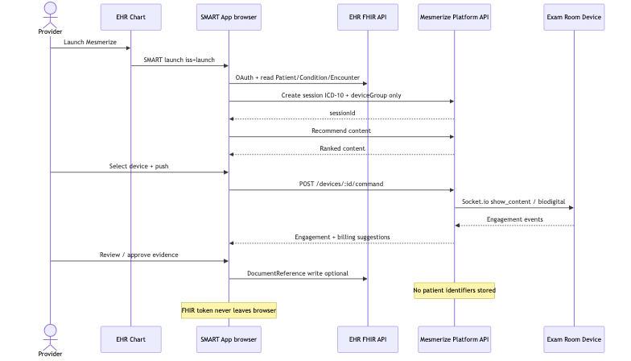

# 07. Functional Architecture

| Field | Value |
|-------|-------|
| Chapter ID | `07-functional-architecture` |
| SAD mapping | Template §7 Functional Architecture |
| Last updated | 2026-07-23 |
| Maturity | Draft · 75% (see `../PROGRESS.md`) |

## Purpose of this chapter

Describe the Content Evidence Platform’s **end-to-end clinical encounter capability chain** — launch → recommend → push → engage → suggest → approve → DocumentReference writeback — and the auth surfaces that enable it, without inventing undeclared APIs or ambient/audio paths.

## Narrative

### Product capability (not ambient scribe)

  <strong>Confirmed:</strong> Build the <strong>Content Evidence Platform</strong>: SMART app + device platform + engagement telemetry + billing suggestions. Do <strong>not</strong> capture audio, transcribe, or generate clinical notes in this program (ADR-001).

  <strong>Confirmed:</strong> EHR FHIR access token never leaves the browser; Mesmerize Platform receives only ICD-10 codes + device group ID + opaque session ID — no patient identifiers on Mesmerize servers (ARCHITECTURE.md; ADR-002).

### Capability chain (happy path)

| Step | Capability | Actor / surface | What happens |
|------|------------|-----------------|--------------|
| 1 | **Launch** | EHR → SMART app | SMART OAuth2 launch; browser FHIR read Patient / Condition (ICD-10) / Encounter |
| 2 | **Session** | SMART → Platform | Create opaque session with ICD-10 + deviceGroup only; Mesmerize session token |
| 3 | **Recommend** | SMART → content-service | ICD-10 → content metadata match; ranked catalog (CPT not a match key) |
| 4 | **Push** | SMART → Device Command API → device | Server-mediated Socket.io `show_content` / BioDigital; no direct SMART↔device |
| 5 | **Engage** | Device → engagement-service | De-identified telemetry: content ID, timestamps, duration, interactions |
| 6 | **Suggest** | billing-evidence | CPT/HCPCS/HCC **suggestions + evidence** from engagement (not claims/EDI) |
| 7 | **Approve** | Physician in SMART UI | Human-in-the-loop review/approve before any chart documentation use |
| 8 | **Writeback** | SMART → EHR FHIR | Browser DocumentReference (education / service-delivery); optional / disable-able |

  <strong>Confirmed:</strong> Billing is <strong>suggest + human-in-the-loop</strong>; Mesmerize does not submit claims. Writeback is FHIR <strong>DocumentReference</strong> from the browser with the EHR token; backend never calls EHR APIs (ADR-003; ADR-008).

## Encounter happy path

*Figure 7-1: Encounter happy path — SMART launch → FHIR read → session + recommend → device push → engagement → billing suggestions → physician approve → optional DocumentReference writeback (`output_diagrams/03-encounter-flow`).*

### Step detail

1. **Launch / read (browser):** Provider launches Mesmerize from the EHR chart; SMART app completes OAuth and reads Condition (ICD-10) and related FHIR resources with the **EHR token** — identifiers stay in the browser.
2. **Session open:** SMART creates a Platform session with ICD-10 set + device group; API returns opaque `sessionId` (Mesmerize session token for subsequent Platform calls).
3. **Recommend:** content-service ranks educational content from ICD-10 → catalog metadata; clinician may browse/search and refine selection.
4. **Push:** Clinician selects exam-room device; SMART posts Device Command; Platform fans out via Socket.io to the PWA.
5. **Engage:** Device emits de-identified engagement events; engagement-service stores session-keyed telemetry (no patient keys).
6. **Suggest:** billing-evidence engine turns engagement + ICD-10 context into CPT/HCPCS/HCC suggestions with supporting evidence.
7. **Approve:** Physician reviews suggestions in SMART UI; approval is required before writeback / official documentation use.
8. **Writeback (when enabled):** `packages/fhir-engagement` formats a DocumentReference (architecture cites LOINC **69730-0** Instructions); SMART writes it to the EHR with the EHR token. Feature is **configurable / disable-able per customer**.

  <strong>Confirmed:</strong> Engagement is stored as <strong>de-identified session telemetry</strong> (content ID, ICD-10, device ID, timestamps, duration, interactions + session/clinic linkage) — no patient identifiers (ADR-008).

  <strong>Inferred:</strong> Waiting-room specialty playlists (Sanity) and optional anonymous aggregate condition categories for playlist optimization remain off the core exam-room evidence path; still no patient IDs (ARCHITECTURE.md).

## Auth model (functional surfaces)

*Figure 7-2: Auth model — SMART EHR OAuth + Mesmerize session token; Command Center Auth0 + RBAC; device Esper provisioning + device token; Bridge secure link + timeout (`output_diagrams/05-auth-model`).*

| Surface | Auth mechanism | Used for |
|---------|----------------|----------|
| **SMART Web App** | EHR authenticates provider → SMART OAuth2 launch → Mesmerize session token for Platform API | Clinical encounter path; browser FHIR with EHR token |
| **Command Center** | Auth0 login + RBAC | Admin / clinic operations (not the FHIR writeback path) |
| **Waiting / Exam Room devices** | Esper provisioning → device token | Socket.io / device APIs; presence and commands |
| **Bridge (patient)** | Secure link + one-time code; inactivity timeout | Patient-facing bridge surface (separate from clinician SMART path) |

  <strong>Confirmed:</strong> Two token worlds on the SMART path: <strong>EHR FHIR token</strong> (browser only) and <strong>Mesmerize session token</strong> (Platform REST). Device commands are always server-mediated (ARCHITECTURE.md; ADR-007).

  <strong>Proposed:</strong> Command Center RBAC role rollout timing follows Q&A phasing; Auth0 remains the identity provider for admin surfaces (auth diagram).

## Functional capabilities by actor

| Actor | Capabilities |
|-------|--------------|
| **Provider (clinician)** | Launch SMART; review ICD-10 context; select/push content; review engagement + billing evidence; approve; optional DocumentReference writeback |
| **SMART Web App** | OAuth + FHIR read/write in browser; session/recommend/push/approve UX; format writeback via `fhir-engagement` |
| **Mesmerize Platform** | Opaque session, recommend, device command, engagement ingest, billing suggestions — never EHR FHIR, never patient IDs |
| **Exam-room device PWA** | Receive Socket.io commands; play content; emit de-identified engagement |
| **EHR (athenahealth pilot)** | SMART launch host; FHIR Condition/Encounter/Patient read; DocumentReference write target |

## Evidence

- [ADR-001](../../../docs/adr/001-content-evidence-not-ambient-scribe.md) — Content Evidence (not ambient scribe)
- [ADR-003](../../../docs/adr/003-documentreference-engagement-writeback.md) — browser DocumentReference; HITL; no claims
- [ADR-008](../../../docs/adr/008-engagement-telemetry-billing-hitl-writeback.md) — de-identified telemetry; suggest-only billing; disable-able writeback
- [`docs/ai/ARCHITECTURE.md`](../../../docs/ai/ARCHITECTURE.md) — SMART capabilities, API groups, happy path, auth model
- [`output_diagrams/03-encounter-flow.mmd`](../../../output_diagrams/03-encounter-flow.mmd) / PNG — encounter sequence
- [`output_diagrams/05-auth-model.mmd`](../../../output_diagrams/05-auth-model.mmd) / PNG — auth surfaces

## White spots

  <strong>Unknown:</strong> Exact DocumentReference payload field catalog and athenahealth acceptance criteria for pilot writeback (customer/EHR configuration dependent per ADR-003).

  <strong>Inferred:</strong> MVP SMART scopes align with Q&A (<code>launch/encounter</code>, Patient/Condition/Encounter read, DocumentReference write); imaging scopes remain out of SOW #3 (ADR-009).

  <strong>Proposed:</strong> Bridge patient auth and waiting-room playlist optimization stay documented as adjacent surfaces; core pilot success path is exam-room Content Evidence through DocumentReference.

## Open questions

1. What customer-configurable flags gate writeback vs. evidence-only export for the athenahealth pilot?
2. Is Bridge patient auth in MVP pilot scope or post-pilot adjacency?
3. Command Center RBAC phase cutover vs Auth0-only admin MVP?
4. Exact LOINC / category coding required by athenahealth for DocumentReference acceptance?
