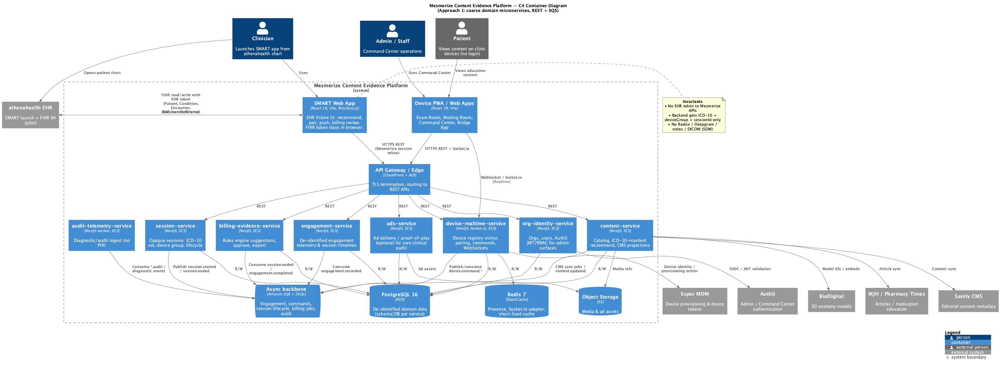
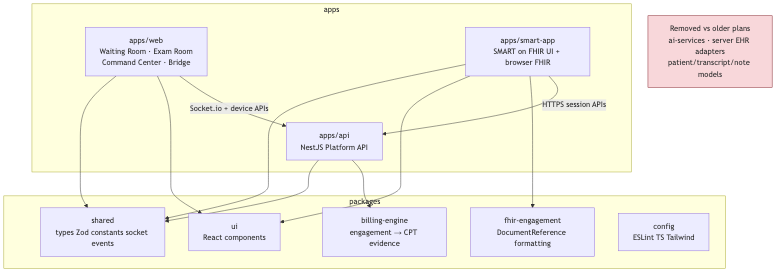

# 08. System Architecture

| Field | Value |
|-------|-------|
| Chapter ID | `08-system-architecture` |
| SAD mapping | Template §8 Component Responsibilities / Component Interactions |
| Last updated | 2026-07-23 |
| Maturity | Draft · 75% (see `../PROGRESS.md`) |

## Purpose of this chapter

Describe the Content Evidence Platform’s runtime containers and monorepo boundaries: who owns what, how edge clients reach NestJS services, and how services depend on Postgres, Redis, S3, SQS, and externals — without inventing undeclared APIs or SLOs.

## Narrative

### Planes and invariants

  <strong>Confirmed:</strong> Three planes — <strong>Cloud (AWS)</strong> (SMART hosting, NestJS platform services, PostgreSQL + Redis, S3), <strong>EHR SMART launch</strong> (pilot athenahealth iframe), <strong>clinic edge</strong> (Microtouch / PWA devices, Command Center, Esper MDM) (ARCHITECTURE.md).

  <strong>Confirmed:</strong> EHR FHIR access token never leaves the browser; Mesmerize APIs receive only ICD-10 codes + device group ID + opaque session ID — no patient identifiers on Mesmerize servers (ADR-002; ARCHITECTURE.md).

  <strong>Confirmed:</strong> Device commands are <strong>server-mediated</strong>: SMART app → Platform Device Command API → Socket.io → device; SMART app never talks to devices directly (ADR-007).

### Technology stack (runtime)

  <strong>Confirmed:</strong> React 19 / Vite / Tailwind frontends; <code>fhirclient.js</code> for SMART; NestJS / TypeScript backend; PostgreSQL 16 + Prisma; Redis 7; Socket.io; Turborepo + npm workspaces; Auth0 for admin / Command Center; Esper MDM; Sanity + BioDigital + MJH content; Mesmerize-owned AWS (ECS/Fargate, RDS, ElastiCache, S3, CloudFront) (ADR-010 S1–S13).

## Component Responsibilities

### Edge applications

| Component | Responsibility | Evidence |
|-----------|----------------|----------|
| **SMART Web App** (`apps/smart-app`) | EHR iframe UI: SMART launch, browser FHIR read/write, recommend, pair/push, engagement + billing review, DocumentReference writeback with EHR token | Confirmed |
| **Device PWA / Web Apps** (`apps/web` + extend `touchscreen-ux`) | Exam Room, Waiting Room, Command Center, Bridge; receive Socket.io commands; emit de-identified engagement | Confirmed |
| **API Gateway / Edge** | CloudFront + ALB TLS termination and routing to REST; sticky TG for Socket.io | Confirmed |

  <strong>Confirmed:</strong> Prefer <strong>extending</strong> the live PWA lineage over a greenfield rewrite; production fleet app is extend/copy, not in-place overwrite by delivery partners (ADR-007).

### NestJS platform services

  <strong>Confirmed:</strong> Logical NestJS containers (ECS/Fargate): session, content, device-realtime, engagement, billing-evidence, org-identity, audit-telemetry, and optional ads — plus Postgres / Redis / S3 / SQS (ARCHITECTURE.md C4; ADR-010; ADR-015). Early pilot may <strong>co-locate</strong> tasks (ADR-015).

| NestJS service | Responsibilities | Primary dependencies |
|----------------|------------------|----------------------|
| **session-service** | Opaque session lifecycle; store ICD-10 set, clinic/device group, status; publish `session.started` / `session.ended` | PostgreSQL; SQS |
| **content-service** | Catalog, ICD-10→content recommend, CMS projections / sync jobs | PostgreSQL; S3 (media refs); SQS; Sanity; BioDigital; MJH |
| **device-realtime-service** | Device registry mirror, pairing, Device Command API, Socket.io rooms / presence | PostgreSQL; Redis (Socket.io adapter); SQS; Esper identity mirror; sticky ALB |
| **engagement-service** | De-identified engagement telemetry & session timelines; consume engagement events | PostgreSQL; SQS |
| **billing-evidence-service** | Rules-engine CPT suggestions / evidence; approve; export; consume session/engagement facts | PostgreSQL; SQS; `packages/billing-engine` |
| **org-identity-service** | Organizations, users, `tenancyMode`, Auth0 JWT / RBAC for admin surfaces | PostgreSQL; Auth0 |
| **audit-telemetry-service** | Diagnostic / audit ingest worker (no PHI); consume `*.audit` / diagnostic events | SQS; diagnostic store (S3 path) |
| **ads-service** *(optional)* | Ad delivery / proof-of-play — not on the core clinical path | PostgreSQL; S3; SQS |

  <strong>Inferred:</strong> Monorepo <code>apps/api</code> is the NestJS entry that hosts or fronts these logical services; process-per-service vs co-located modules is a deploy choice (ADR-015 co-locate OK early), not a different product boundary.

### Shared packages (monorepo)

| Package | Responsibility |
|---------|----------------|
| `packages/shared` | Types, Zod, constants, Socket.io event contracts |
| `packages/ui` | Shared React UI |
| `packages/billing-engine` | Engagement → CPT suggestion / evidence (no claims) |
| `packages/fhir-engagement` | Browser-side DocumentReference formatting (not server EHR adapters) |
| `packages/config` | ESLint / TS / Tailwind shared config |

  <strong>Confirmed:</strong> Do <strong>not</strong> resurrect <code>packages/ai-services</code>, server-side EHR adapters, or patient/transcript/clinical-note models (ADR-011; ARCHITECTURE.md monorepo).

### Data and messaging stores

| Store | Role |
|-------|------|
| **PostgreSQL 16** | De-identified domain data (Bridge `tenantId` default) |
| **Redis 7** | Presence, Socket.io adapter, short-lived cache |
| **S3** | Media / ads at `{tenantId}/{clinicId}/…` |
| **SQS + DLQs** | Internal RR / events / poison path (ADR-014) |

## Component Interactions

### C4 containers

*Figure 8-1: C4 containers — SMART app, device PWAs, gateway, NestJS services, Postgres/Redis/S3/SQS, and externals (athenahealth, Auth0, Esper, Sanity, BioDigital, MJH).*

### Interaction summary

| From | To | How | Notes |
|------|-----|-----|-------|
| Clinician / EHR | SMART Web App | EHR launch iframe | Pilot athenahealth |
| SMART Web App | athenahealth FHIR | Browser HTTPS + EHR token | Token never to Mesmerize |
| SMART Web App | Gateway → NestJS | HTTPS REST + Mesmerize session token | ICD-10 + deviceGroup + sessionId only |
| Device PWA | Gateway / device-realtime | HTTPS REST + Socket.io | Esper device token |
| Gateway | session / content / device / engagement / billing / org / ads | REST | ALB routing |
| session / device / content | SQS | Publish lifecycle, commands, CMS jobs | Fire-and-forget or RR per ADR-014 |
| engagement / billing / audit | SQS | Consume events / RR | No PHI in payloads |
| device-realtime | Redis | Adapter / presence | Sticky ALB TG |
| content / ads | S3 | Media / ad refs | Tenant-prefixed keys |
| org-identity | Auth0 | OIDC / JWT validation | Admin / Command Center |
| content-service | Sanity / BioDigital / MJH | HTTPS sync / embeds | No patient IDs |

  <strong>Confirmed:</strong> Edge interactive path stays <strong>REST</strong> (plus Socket.io for devices); internal wait-for-result uses SQS Request/Reply + <code>correlationId</code>; async facts use fire-and-forget; poison path uses enricher → DLQ (ADR-014). Detail in Chapter 12.

  <strong>Proposed:</strong> Coarse domain microservices (Approach 1 on the C4 diagram) as the target runtime shape; final process boundaries for pilot may still co-locate on one ECS cluster until scale requires split (ADR-015).

### Monorepo boundaries

*Figure 8-2: Monorepo boundaries — `apps/smart-app`, `apps/web`, `apps/api` and packages `shared`, `ui`, `billing-engine`, `fhir-engagement`, `config` (ARCHITECTURE.md § Monorepo).*

  <strong>Confirmed:</strong> SMART app calls Platform API over HTTPS with a Mesmerize session token; device apps use Socket.io + device APIs; FHIR writeback formatting lives in <code>fhir-engagement</code> on the browser path — backend never calls EHR APIs (ARCHITECTURE.md; ADR-003).

## Evidence

- [`docs/ai/ARCHITECTURE.md`](../../../docs/ai/ARCHITECTURE.md) — planes, components, monorepo, C4 building blocks
- [ADR-007](../../../docs/adr/007-extend-pwa-server-mediated-devices.md) — extend PWA; server-mediated devices; Socket.io; Esper IDs
- [ADR-010](../../../docs/adr/010-technology-stack.md) — S1–S15 stack
- [ADR-014](../../../docs/adr/014-sqs-messaging-patterns.md) — REST edge + SQS internal patterns
- [ADR-015](../../../docs/adr/015-aws-deployment-reference.md) — ECS co-locate / sticky ALB for device-realtime
- [`output_diagrams/06-c4-containers.puml`](../../../output_diagrams/06-c4-containers.puml) / PNG — container responsibilities & relations
- [`output_diagrams/04-monorepo-boundaries.mmd`](../../../output_diagrams/04-monorepo-boundaries.mmd) / PNG — app/package boundaries

## White spots

  <strong>Unknown:</strong> Final process-per-service vs co-located NestJS modules for pilot cutover timing; exact public REST route catalog per service beyond architecture API groups.

  <strong>Inferred:</strong> <code>apps/api</code> as the deployable NestJS surface that maps to the logical C4 services until split.

  <strong>Proposed:</strong> Optional <code>ads-service</code> remains off the core clinical path until product prioritizes proof-of-play.

## Open questions

1. When does pilot move from co-located NestJS tasks to one ECS service per C4 container?
2. Is API Gateway a dedicated product (e.g. API Gateway/App Mesh) or only CloudFront + ALB as documented?
3. Shared NestJS library boundaries for Prisma clients / SQS consumers across services?
4. Command Center RBAC phase vs Auth0-only MVP for admin surfaces?
