# 08. System Architecture

| Field | Value |
|-------|-------|
| Chapter ID | `08-system-architecture` |
| SAD mapping | Template §8 Component Responsibilities / Component Interactions |
| Last updated | 2026-08-19 |
| Maturity | Review-ready · 75% |

## Purpose of this chapter

Describe the Content Evidence Platform’s runtime containers and **logical module** boundaries: who owns what, how edge clients reach **Python / FastAPI** platform services, and how services depend on Postgres, Redis, S3, SQS, and externals — without inventing undeclared APIs or SLOs. **Physical git** is per-service repositories ([ADR-017](../../../docs/adr/017-python-platform-backend.md); customer **D-07**). Exam-room **imaging evidence** (taxonomy, capture vs write-back) is specified in [Chapter 19](19-imaging-mirror-evidence-addendum.md); **display / transport** (Tier 1 + Tier 2) is [Chapter 20](20-exam-room-imaging-mirror.md). This chapter only places those flows on the C4 runtime.

## Narrative

### Planes and invariants

  <strong>Confirmed:</strong> Three planes — <strong>Cloud (AWS)</strong> (SMART hosting, <strong>Python / FastAPI</strong> platform services, PostgreSQL + Redis, S3), <strong>EHR SMART launch</strong> (pilot athenahealth iframe), <strong>clinic edge</strong> (Microtouch / PWA devices, Command Center, Esper MDM) (ARCHITECTURE.md; ADR-017).

  <strong>Confirmed:</strong> EHR FHIR access token never leaves the browser. Mesmerize APIs receive <strong>no patient identifiers</strong> (not Patient ID, MRN, name, encounter ID, demographics) (ADR-002). Content path: ICD-10 codes + device group ID + opaque session ID. Imaging path: the same session/device-group keys plus artifact <strong>kind / opaque id</strong> or a <code>mirror</code> flag — <strong>never</strong> pixels, DICOM, or FHIR resource dumps (<a href="../../../docs/adr/019-exam-room-imaging-display-and-evidence.md">ADR-019</a>; [Chapter 19](19-imaging-mirror-evidence-addendum.md)).

  <strong>Confirmed:</strong> Device commands are <strong>server-mediated</strong>: SMART app → Platform Device Command API → Socket.io → device; SMART app never talks to devices on a command/data channel (ADR-007). For exam-room imaging, Platform also carries WebRTC <strong>signaling only</strong>; WebRTC <strong>media is P2P</strong> (clinician browser ↔ device) and must <strong>not</strong> traverse the API as a media path (<a href="../../../docs/adr/019-exam-room-imaging-display-and-evidence.md">ADR-019</a>). Signaling is this pack’s decision — <strong>not</strong> a customer <code>INFRASTRUCTURE.md</code> <code>D-xx</code>.

### Imaging evidence vs display (Ch.19 / Ch.20)

Runtime split matches [Chapter 19](19-imaging-mirror-evidence-addendum.md): **two de-identified event classes**, both session-keyed and **not Patient-linked**.

| Class | Runtime owner (logical) | What Platform stores | Write-back (athena v1) |
|-------|-------------------------|----------------------|------------------------|
| **Content engagement** | engagement-service | Content ID, ICD-10 set, device ID, timestamps, duration, interactions | HITL → browser `DocumentReference.write` |
| **`imaging_session`** | Platform de-identified store (SoR; **implementation service TBD** — [Chapter 09](09-data-architecture.md)) | Timestamps, device id, opaque session id, tier (`1` \| `2`), artifact type **or** `mirror` flag. Event **name** TBD; **concept** Confirmed | Same HITL → browser `DocumentReference.write` (existing write scope) |

  <strong>Confirmed:</strong> Imaging <strong>capture is universal</strong> whenever Tier 1 or Tier 2 is shown. The Platform store is the <strong>system of record</strong>; a missing or failed EHR write-back <strong>never drops</strong> captured evidence. Physician HITL approve, then browser DocumentReference to athena, is the v1 deposit path. <strong>No pixels, DICOM, or imaging bytes</strong> on RDS, S3, or logs. No Mesmerize DICOM viewer. No <code>ImagingStudy</code> / WADO ingest (ADR-019; ADR-003; ADR-008; ADR-011 DNB-9; [Chapter 19](19-imaging-mirror-evidence-addendum.md)).

  <strong>Proposed:</strong> Additive FHIR <strong>read</strong> strings for Tier 1 browser fetches until <strong>Q-16</strong>: <code>patient/DiagnosticReport.read</code>, <code>patient/DocumentReference.read</code>, <code>patient/Media.read</code>, <code>patient/Observation.read</code>. Four-EHR Observation/Provenance / eCW HL7 adapters are <strong>roadmap</strong>, not v1 ([Chapter 19](19-imaging-mirror-evidence-addendum.md)).

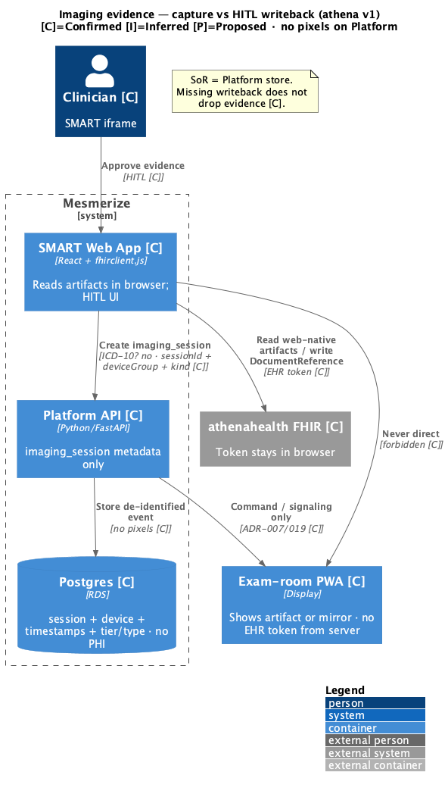

*Figure 8-11: Same evidence path as Figure 19-1 — clinician SMART reads FHIR in the browser; Platform stores de-identified `imaging_session` metadata only; HITL then DocumentReference to athena. No pixels on Platform ([Chapter 19](19-imaging-mirror-evidence-addendum.md)).*

### Technology stack (runtime)

  <strong>Confirmed:</strong> React 19 / Vite / Tailwind frontends; <code>fhirclient.js</code> for SMART; <strong>Python / FastAPI</strong> backend; PostgreSQL 16 + <strong>SQLAlchemy 2 / Alembic</strong>; Redis 7; Socket.io (<code>python-socketio</code> on server); <strong>per-service GitHub repos</strong> (D-07 / ADR-017; pnpm in TS repos; uv/Poetry in the API repo); Auth0 for admin / Command Center; Esper MDM; Sanity + BioDigital + MJH content; Mesmerize-owned AWS (ECS/Fargate, RDS, ElastiCache, S3, CloudFront) (ADR-010 S1–S13 as amended by ADR-017).

## Component Responsibilities

### Edge applications

| Component | Responsibility | Evidence |
|-----------|----------------|----------|
| **SMART Web App** (`apps/smart-app`) | EHR iframe UI: SMART launch, browser FHIR read/write (content path + optional Tier 1 web-native artifact **reads**), recommend, pair/push, Device Command, WebRTC **signaling** (not media), engagement + billing + **imaging evidence** HITL, DocumentReference writeback with EHR token | Confirmed |
| **Device PWA / Web Apps** (`apps/web` + extend `touchscreen-ux`) | Exam Room, Waiting Room, Command Center, Bridge; receive Socket.io commands (`show_content` / `show_artifact`); emit de-identified engagement; render web-native artifacts or a P2P mirror stream. **No** server-held EHR token; **no** pixels sent to Platform | Confirmed |
| **API Gateway / Edge** | CloudFront + ALB TLS termination and routing to REST; sticky TG for Socket.io | Confirmed |

  <strong>Confirmed:</strong> Prefer <strong>extending</strong> the live PWA lineage over a greenfield rewrite; production fleet app is extend/copy, not in-place overwrite by delivery partners (ADR-007). Extend-PWA / device runtime delivery uses <strong>Ladder B</strong> (Netlify web preview ≠ device; manual TTV filesync; Esper tags) — not Ladder A ECS (ADR-007; ADR-016). Detail in [Chapter 13](13-deployment-and-infrastructure.md).

### Platform services (Python / FastAPI)

  <strong>Confirmed:</strong> Logical platform containers (ECS/Fargate): session, content, device-realtime, engagement, billing-evidence, org-identity, audit-telemetry, and optional ads — plus Postgres / Redis / S3 / SQS (ARCHITECTURE.md C4; ADR-010; ADR-015; ADR-017). Early pilot may <strong>co-locate</strong> tasks (ADR-015). Implementation language is <strong>Python</strong> (FastAPI reference).

| Platform service | Responsibilities | Primary dependencies |
|------------------|------------------|----------------------|
| **session-service** | Opaque session lifecycle; store ICD-10 set, clinic/device group, status; publish `session.started` / `session.ended`. Does **not** store imaging bytes or Patient IDs | PostgreSQL; SQS |
| **content-service** | Catalog, ICD-10→content recommend, CMS projections / sync jobs | PostgreSQL; S3 (media refs); SQS; Sanity; BioDigital; MJH |
| **device-realtime-service** | Device registry mirror, pairing, Device Command API (including imaging **display** commands), Socket.io rooms / presence, WebRTC **signaling** (SDP/ICE) for Tier 2 — **no** WebRTC media and **no** imaging payloads on the API | PostgreSQL; Redis (Socket.io adapter); SQS; Esper identity mirror; sticky ALB |
| **engagement-service** | De-identified **content engagement** telemetry & session timelines; consume engagement events. **Not** the exclusive owner of `imaging_session` (Platform SoR; service TBD — Ch.09 / Ch.19) | PostgreSQL; SQS |
| **billing-evidence-service** | Rules-engine CPT suggestions / evidence; approve; export; consume session/engagement facts | PostgreSQL; SQS; `packages/billing-engine` |
| **org-identity-service** | Organizations, users, `tenancyMode`, Auth0 JWT / RBAC for admin surfaces | PostgreSQL; Auth0 |
| **audit-telemetry-service** | Diagnostic / audit ingest worker (no PHI); consume `*.audit` / diagnostic events | SQS; diagnostic store (S3 path) |
| **ads-service** *(optional)* | Ad delivery / proof-of-play — not on the core clinical path | PostgreSQL; S3; SQS |

  <strong>Inferred:</strong> Monorepo <code>apps/api</code> (Python / FastAPI) is the entry that hosts or fronts these logical services; process-per-service vs co-located modules is a deploy choice (ADR-015 co-locate OK early), not a different product boundary.

### Shared packages (logical; may live across service repos)

| Package | Responsibility |
|---------|----------------|
| `packages/shared` | Types, Zod, constants, Socket.io event contracts |
| `packages/ui` | Shared React UI |
| `packages/billing-engine` | Engagement → CPT suggestion / evidence (no claims) |
| `packages/fhir-engagement` | Browser-side DocumentReference formatting for content engagement **and** imaging evidence (not server EHR adapters) |
| `packages/config` | ESLint / TS / Tailwind shared config |

  <strong>Confirmed:</strong> Do <strong>not</strong> resurrect <code>packages/ai-services</code>, server-side EHR adapters, or patient/transcript/clinical-note models (ADR-011; ARCHITECTURE.md).

### Data and messaging stores

| Store | Role |
|-------|------|
| **PostgreSQL 16** | De-identified domain data (Bridge `tenantId` default), including `imaging_session` **metadata** when persisted — **never** pixels/DICOM |
| **Redis 7** | Presence, Socket.io adapter, short-lived cache |
| **S3** | Education / ads media at `{tenantId}/{clinicId}/…`. **Forbidden:** imaging payloads, DICOM, screen-share recordings ([Chapter 19](19-imaging-mirror-evidence-addendum.md)) |
| **SQS + DLQs** | Internal RR / events / poison path (ADR-014), including fire-and-forget `imaging_session` metadata facts ([Chapter 12](12-messaging-and-integration.md)) |

## Component Interactions

### C4 containers

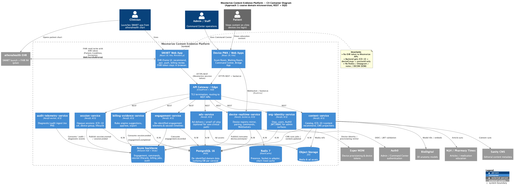

*Figure 8-1: C4 containers — SMART app, device PWAs, gateway, Python platform services, Postgres/Redis/S3/SQS, and externals (athenahealth, Auth0, Esper, Sanity, BioDigital, MJH).*

### Interaction summary

| From | To | How | Notes |
|------|-----|-----|-------|
| Clinician / EHR | SMART Web App | EHR launch iframe | Pilot athenahealth |
| SMART Web App | athenahealth FHIR | Browser HTTPS + EHR token | Token never to Mesmerize. Reads: Patient/Condition/Encounter; optional Tier 1 web-native artifacts (Proposed strings until **Q-16**). Write: HITL `DocumentReference` (content **and** imaging evidence) |
| SMART Web App | Gateway → Platform API | HTTPS REST + Mesmerize session token | ICD-10 + deviceGroup + sessionId; imaging: + artifact kind / opaque id or `mirror` — **no** payload |
| Device PWA | Gateway / device-realtime | HTTPS REST + Socket.io | Esper device token; `show_content` / `show_artifact` + **signaling** (not media) |
| SMART Web App ↔ Device PWA | WebRTC **media** (Tier 2) | P2P | Window/tab-scoped share only; **not** via Platform API ([ADR-019](../../../docs/adr/019-exam-room-imaging-display-and-evidence.md)) |
| SMART Web App | Platform (`imaging_session`) | HTTPS REST + Mesmerize session | Capture universal; SoR on Platform; HITL writeback is a **separate** browser→EHR hop ([Chapter 19](19-imaging-mirror-evidence-addendum.md)) |
| Gateway | session / content / device / engagement / billing / org / ads | REST | ALB routing |
| session / device / content | SQS | Publish lifecycle, commands, CMS jobs | Fire-and-forget or RR per ADR-014 |
| engagement / billing / audit | SQS | Consume events / RR | No PHI in payloads |
| device-realtime | Redis | Adapter / presence | Sticky ALB TG |
| content / ads | S3 | Media / ad refs | Tenant-prefixed keys |
| org-identity | Auth0 | OIDC / JWT validation | Admin / Command Center |
| content-service | Sanity / BioDigital / MJH | HTTPS sync / embeds | No patient IDs |

  <strong>Confirmed:</strong> Edge interactive path stays <strong>REST</strong> (plus Socket.io for devices); internal wait-for-result uses SQS Request/Reply + <code>correlationId</code>; async facts use fire-and-forget; poison path uses enricher → DLQ (ADR-014). Detail in Chapter 12.

  <strong>Proposed:</strong> Coarse domain microservices (Approach 1 on the C4 diagram) as the target runtime shape; final process boundaries for pilot may still co-locate on one ECS cluster until scale requires split (ADR-015).

### Container focus diagrams (platform services)

The following are **C4 container-focus** views derived from diagram `06`: each isolates one platform service and shows **all** of its neighbors. Edges present on `06` are **Confirmed** for this pack’s C4 model; additional edges from ARCHITECTURE / ADRs are labeled **Inferred**. These are not module-level C4 Component diagrams. Implementation language is **Python** (ADR-017); diagram titles may still say “NestJS” historically until PNGs are regenerated.

#### session-service

Owns opaque encounter-session lifecycle (ICD-10 set, clinic/device group, status) and publishes `session.started` / `session.ended`. Does **not** hold EHR tokens or patient identifiers.

| Neighbor | Direction | Mechanism | Evidence |
|----------|-----------|-----------|----------|
| API Gateway / Edge | ← in | REST | Confirmed (`06`) |
| PostgreSQL | → | R/W | Confirmed (`06`) |
| SQS | → | Publish session.* | Confirmed (`06`) |
| SMART Web App (via Gateway) | ← in | HTTPS REST + Mesmerize session token | Inferred (ARCHITECTURE; ADR-002; ADR-008) |

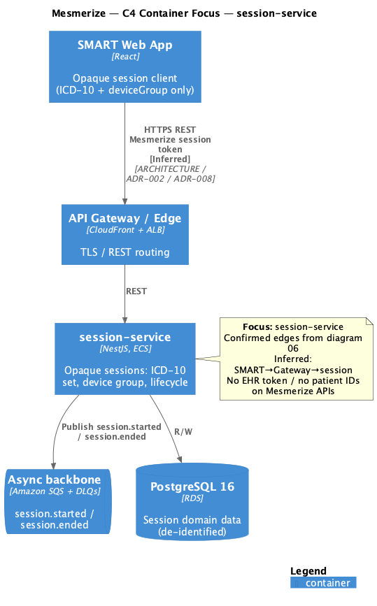

*Figure 8-3: Container focus — session-service (`06a`).*

#### content-service

Owns catalog, ICD-10→content recommend, and CMS projections/sync. Does **not** call EHR FHIR APIs.

| Neighbor | Direction | Mechanism | Evidence |
|----------|-----------|-----------|----------|
| API Gateway / Edge | ← in | REST | Confirmed (`06`) |
| PostgreSQL | → | R/W | Confirmed (`06`) |
| S3 | → | Media refs | Confirmed (`06`) |
| SQS | → | CMS sync / content.updated | Confirmed (`06`) |
| Sanity / BioDigital / MJH | → | HTTPS sync / embeds | Confirmed (`06`) |
| SMART Web App (via Gateway) | ← in | Recommend REST | Inferred (ARCHITECTURE) |

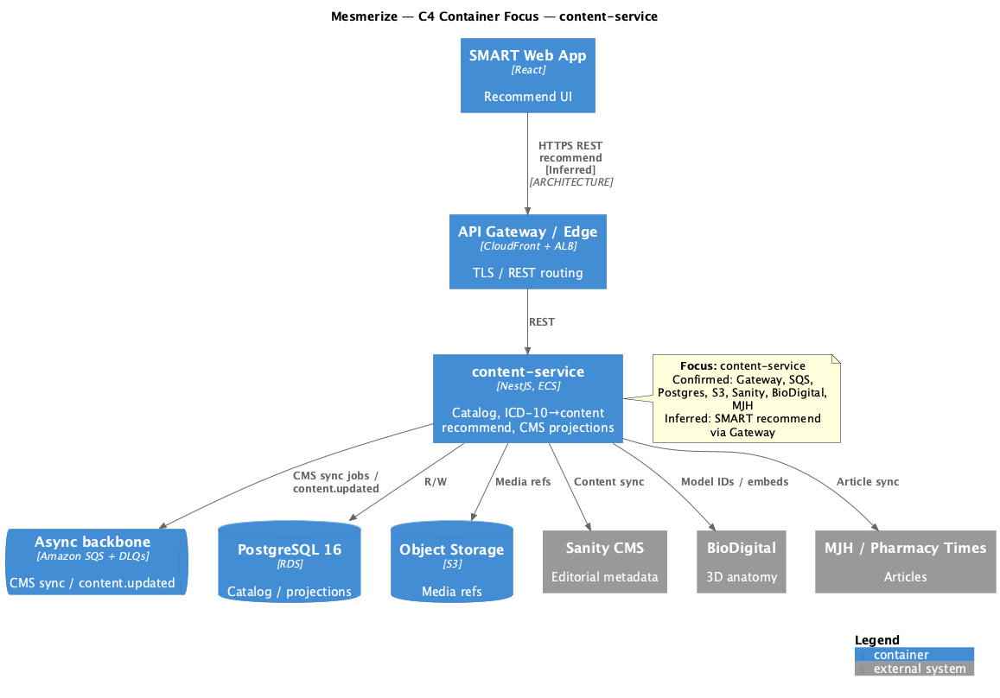

*Figure 8-4: Container focus — content-service (`06b`).*

#### device-realtime-service

Owns device registry mirror, pairing, Device Command API, Socket.io rooms/presence, and WebRTC **signaling** for Tier 2 imaging. SMART never talks to devices directly (ADR-007). **No WebRTC media** on this service ([ADR-019](../../../docs/adr/019-exam-room-imaging-display-and-evidence.md)).

| Neighbor | Direction | Mechanism | Evidence |
|----------|-----------|-----------|----------|
| API Gateway / Edge | ← in | REST | Confirmed (`06`) |
| Device PWA / Web Apps | ↔ | Socket.io (+ REST via Gateway) | Confirmed (`06`) |
| PostgreSQL | → | R/W | Confirmed (`06`) |
| Redis | → | R/W (adapter / presence) | Confirmed (`06`) |
| SQS | → | device.command.* | Confirmed (`06`) |
| Esper MDM | → | Identity / provisioning mirror | Confirmed (`06`) |
| SMART Web App (via Gateway) | ← in | Pair / push commands; imaging **signaling** (not media) | Inferred (ADR-007; ADR-019) |

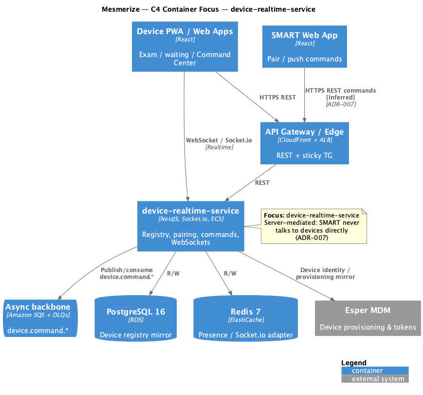

*Figure 8-5: Container focus — device-realtime-service (`06c`).*

#### engagement-service

Owns de-identified **content engagement** telemetry and session timelines. No patient identifiers in payloads. Imaging **metadata** (`imaging_session`) is a **separate** event class ([Chapter 19](19-imaging-mirror-evidence-addendum.md)); owning microservice is TBD (Ch.09) — do not route pixels here.

| Neighbor | Direction | Mechanism | Evidence |
|----------|-----------|-----------|----------|
| API Gateway / Edge | ← in | REST | Confirmed (`06`) |
| SQS | ← in | Consume engagement.recorded | Confirmed (`06`) |
| PostgreSQL | → | R/W | Confirmed (`06`) |
| SMART / admin (via Gateway) | ← in | Timeline reads | Inferred (ADR-008) |

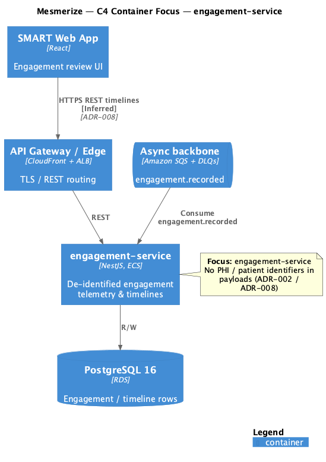

*Figure 8-6: Container focus — engagement-service (`06d`).*

#### billing-evidence-service

Owns rules-engine CPT suggestions/evidence, approve, and export. DocumentReference writeback (education **and** imaging evidence) is **browser → EHR** with the EHR token — this service never calls EHR APIs (ADR-003; [Chapter 19](19-imaging-mirror-evidence-addendum.md)).

| Neighbor | Direction | Mechanism | Evidence |
|----------|-----------|-----------|----------|
| API Gateway / Edge | ← in | REST | Confirmed (`06`) |
| SQS | ← in | session.ended / engagement.completed | Confirmed (`06`) |
| PostgreSQL | → | R/W | Confirmed (`06`) |
| SMART Web App (via Gateway) | ← in | Approve / export | Inferred (ADR-008) |
| SMART → athenahealth FHIR | (client path) | DocumentReference writeback | Inferred (ADR-003 — not service→EHR) |

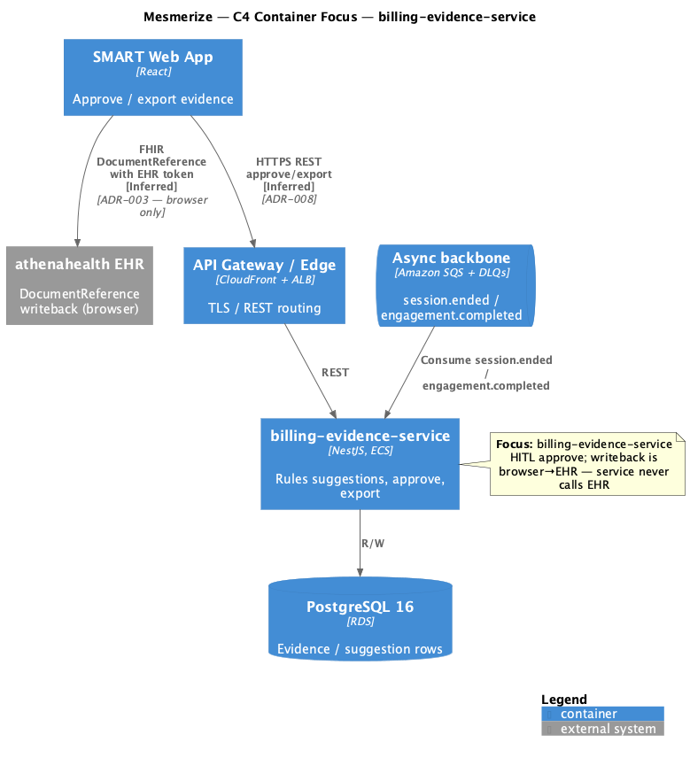

*Figure 8-7: Container focus — billing-evidence-service (`06e`).*

#### org-identity-service

Owns organizations, users, `tenancyMode`, and Auth0 JWT/RBAC for admin / Command Center surfaces — not the clinician SMART EHR-token path.

| Neighbor | Direction | Mechanism | Evidence |
|----------|-----------|-----------|----------|
| API Gateway / Edge | ← in | REST | Confirmed (`06`) |
| PostgreSQL | → | R/W | Confirmed (`06`) |
| Auth0 | → | OIDC / JWT validation | Confirmed (`06`) |
| Command Center (via Gateway) | ← in | Admin JWT path | Inferred (ARCHITECTURE) |

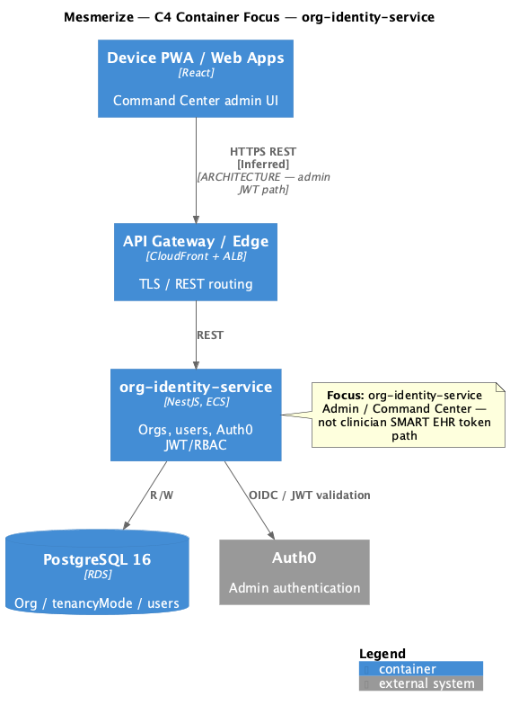

*Figure 8-8: Container focus — org-identity-service (`06f`).*

#### audit-telemetry-service

Worker that consumes diagnostic / `*.audit` events. No Gateway Rel on diagram `06`; no PHI in diagnostic payloads.

| Neighbor | Direction | Mechanism | Evidence |
|----------|-----------|-----------|----------|
| SQS | ← in | *.audit / diagnostic | Confirmed (`06`) |
| S3 (diagnostic path) | → | Diagnostic artifacts | Inferred (ARCHITECTURE; ADR-014) |

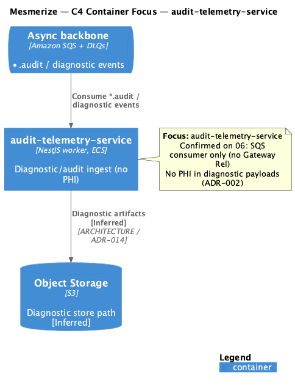

*Figure 8-9: Container focus — audit-telemetry-service (`06g`).*

#### ads-service *(optional)*

Optional ad delivery / proof-of-play. **Not** on the core clinical path.

| Neighbor | Direction | Mechanism | Evidence |
|----------|-----------|-----------|----------|
| API Gateway / Edge | ← in | REST | Confirmed (`06`) |
| PostgreSQL | → | R/W | Confirmed (`06`) |
| S3 | → | Ad assets | Confirmed (`06`) |

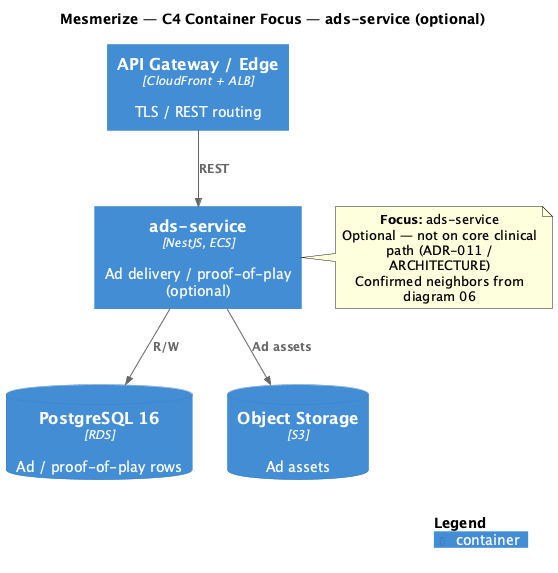

*Figure 8-10: Container focus — ads-service (`06h`, optional).*

### Monorepo boundaries

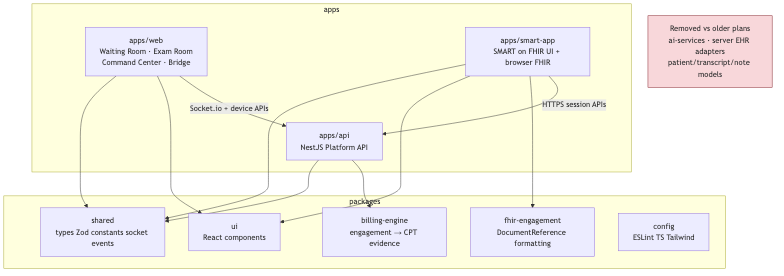

*Figure 8-2: Logical app/package boundaries — `smart-app`, device PWAs, `platform-api`, and libraries `shared`, `ui`, `billing-engine`, `fhir-engagement`, `config`. Physical git is **per-service repos** (D-07 / ADR-017); exact slugs **Q-17**.*

  <strong>Confirmed:</strong> SMART app calls Platform API over HTTPS with a Mesmerize session token; device apps use Socket.io + device APIs; FHIR writeback formatting lives in <code>fhir-engagement</code> on the browser path (content <strong>and</strong> imaging evidence) — backend never calls EHR APIs (ARCHITECTURE.md; ADR-003; [Chapter 19](19-imaging-mirror-evidence-addendum.md)).

## Evidence

- [`docs/ai/ARCHITECTURE.md`](../../../docs/ai/ARCHITECTURE.md) — planes, components, logical modules vs service repos, C4 building blocks
- [ADR-019](../../../docs/adr/019-exam-room-imaging-display-and-evidence.md) — Device Command + signaling for imaging; `imaging_session` evidence; no media/pixels on API; not a customer `D-xx`
- [Chapter 19](19-imaging-mirror-evidence-addendum.md) — capture vs HITL write-back; taxonomy; Figure 19-1 / 8-11
- [Chapter 20](20-exam-room-imaging-mirror.md) — Tier 1 / Tier 2 display and transport
- [ADR-003](../../../docs/adr/003-documentreference-engagement-writeback.md) / [ADR-008](../../../docs/adr/008-engagement-telemetry-billing-hitl-writeback.md) — browser DocumentReference; HITL
- [ADR-007](../../../docs/adr/007-extend-pwa-server-mediated-devices.md) — extend PWA; server-mediated devices; Socket.io; Esper IDs
- [ADR-010](../../../docs/adr/010-technology-stack.md) — S1–S15 stack
- [ADR-014](../../../docs/adr/014-sqs-messaging-patterns.md) — REST edge + SQS internal patterns
- [ADR-015](../../../docs/adr/015-aws-deployment-reference.md) — ECS co-locate / sticky ALB for device-realtime
- [ADR-016](../../../docs/adr/016-git-branching-and-delivery-ladders.md) — Ladder B for device/PWA vs Ladder A for platform
- [`output_diagrams/06-c4-containers.puml`](../../../output_diagrams/06-c4-containers.puml) / PNG — container responsibilities & relations
- [`output_diagrams/06a-c4-focus-session-service`](../../../output_diagrams/06a-c4-focus-session-service.puml) … [`06h-c4-focus-ads-service`](../../../output_diagrams/06h-c4-focus-ads-service.puml) — per-service container-focus views
- [`output_diagrams/04-monorepo-boundaries.mmd`](../../../output_diagrams/04-monorepo-boundaries.mmd) / PNG — app/package boundaries
- [`output_diagrams/23-imaging-evidence-capture-writeback`](../../../output_diagrams/23-imaging-evidence-capture-writeback.puml) / PNG — Figure 8-11 / 19-1 evidence path

## White spots

  <strong>Unknown:</strong> Final process-per-service vs co-located Python service modules for pilot cutover timing; exact public REST route catalog per service beyond architecture API groups. Which platform service persists <code>imaging_session</code> (concept Confirmed; implementation name and owner TBD — [Chapter 19](19-imaging-mirror-evidence-addendum.md)).

  <strong>Inferred:</strong> A <strong>platform-api</strong> service repo (exact slug <strong>Q-17</strong>) is the deployable FastAPI surface that maps to the logical C4 services until split.

  <strong>Proposed:</strong> Optional <code>ads-service</code> remains off the core clinical path until product prioritizes proof-of-play.

## Open questions

Consolidated for Mesmerize decision-making in [Chapter 18 — Assumptions and Open Questions](18-assumptions-and-open-questions.md).

- **A-05** — Platform (Python) services as separate ECS services by cutover
- Related pilot scope / RBAC depth: **Q-10**
- **Q-16** — Ratify additive FHIR **read** scope strings for Tier 1 (owned in [Chapter 18](18-assumptions-and-open-questions.md); cited from [Chapter 19](19-imaging-mirror-evidence-addendum.md))
- **Q-17** — Exact GitHub org + service repo slugs ([Chapter 21](21-development-kickoff-infrastructure-request.md))
