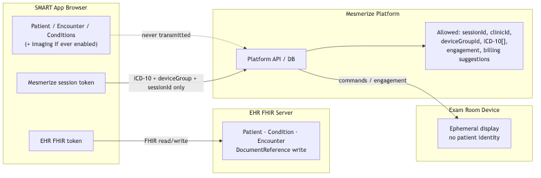
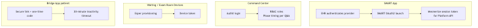
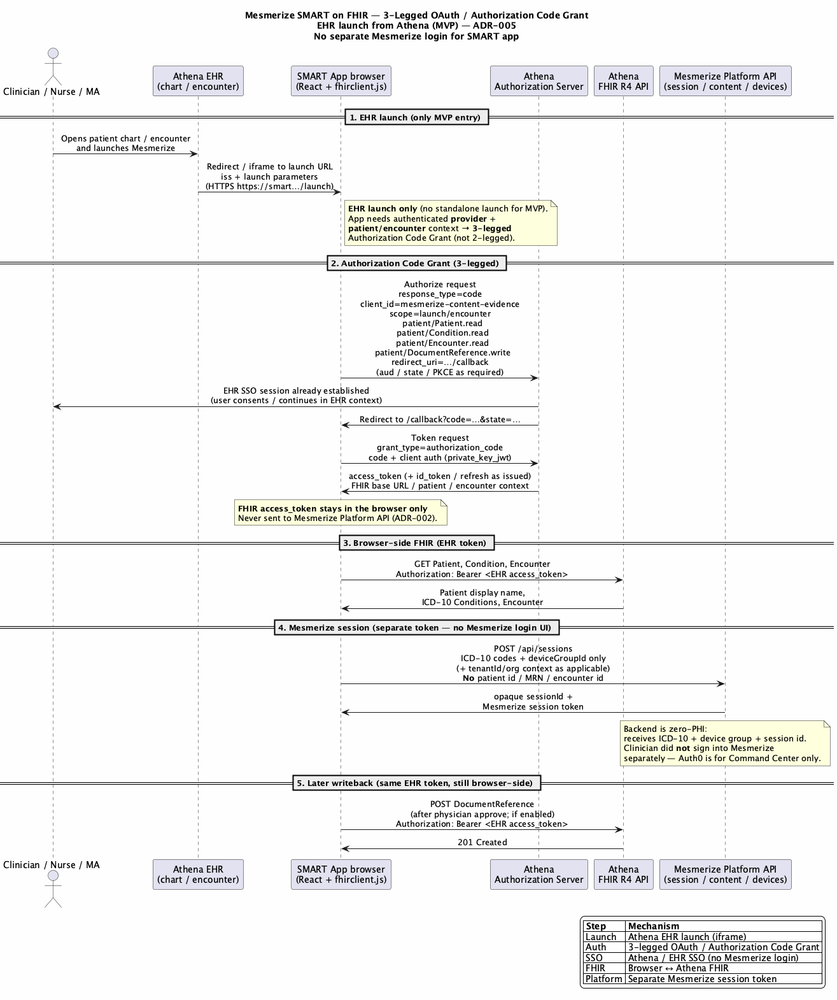
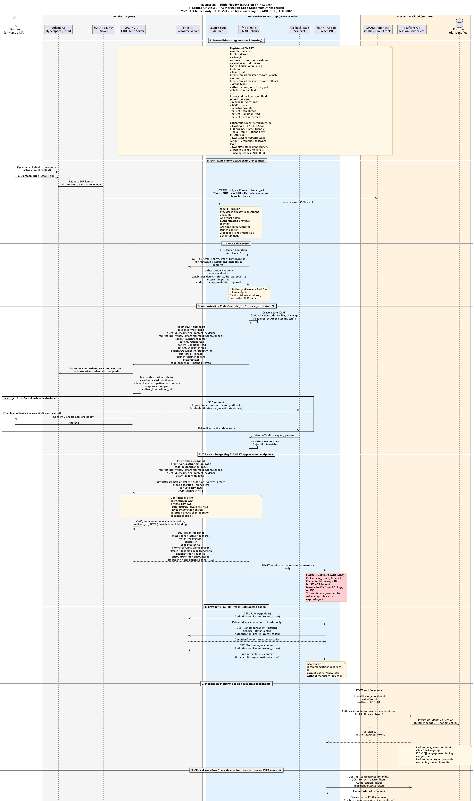

# 10. Security & Privacy

| Field | Value |
|-------|-------|
| Chapter ID | `10-security-and-privacy` |
| SAD mapping | Mesmerize extension |
| Last updated | 2026-07-23 |
| Maturity | Draft · 70% (see `../PROGRESS.md`) |

## Purpose of this chapter

Document the Content Evidence Platform security and privacy model: zero patient identifiers on Mesmerize servers, browser-held FHIR access tokens, SMART 3-legged OAuth for clinicians, Auth0 for admin surfaces, BAA posture, and the audit vs diagnostic logging split. Claims are tagged Confirmed / Inferred / Proposed / Unknown from ADRs and `docs/ai/SECURITY.md` — not legal advice; confirm BAAs and policies with the Mesmerize compliance owner.

## Narrative

### Zero PHI on Mesmerize servers

  <strong>Confirmed:</strong> Mesmerize backend may receive <strong>ICD-10 codes + device group ID + opaque session ID</strong> (plus de-identified engagement/billing artifacts) — <strong>not</strong> Patient ID, MRN, name, encounter ID, or demographics (ADR-002; decisions #6–#8). Platform API never calls EHR FHIR APIs. Schema excludes patient / clinical-note / transcript tables.

| Location | May hold patient-identifying / clinical context? | Notes |
|----------|--------------------------------------------------|-------|
| SMART app browser | Yes, **session-only** | FHIR token + Patient/Encounter/Conditions; cleared when session/token ends |
| Mesmerize Platform API / DB | **No patient identifiers** | ICD-10 + session UUID + device/clinic + engagement + billing suggestions |
| Socket.io signaling | No patient content | Opaque signaling metadata |
| Exam-room device | Ephemeral display only | No patient identity on device; UUID engagement tracking |
| EHR | System of record | Owns clinical chart and SMART access audit trail |

  <strong>Confirmed:</strong> Safe Harbor framing in kb: ICD-10 codes <strong>without</strong> patient linkage are treated as non-PHI for Mesmerize server storage. Do not reintroduce linkage keys (<code>docs/ai/SECURITY.md</code>).

**Server-side allowed examples:** session ID, device ID, clinic/M-number, content ID, ICD-10, timestamps, durations, interaction events, billing suggestions keyed to session.

**Not allowed on servers:** Patient ID/MRN/name/DOB/address/SSN/contact, insurance, meds/allergies, problem-list history as patient-linked records, FHIR resource dumps, audio, transcripts, clinical notes, imaging payloads.

Tenant isolation (Silo / Bridge) is **orthogonal** to PHI rules: even correctly tenant-scoped data must not contain patient identifiers (see Chapter 11 / ADR-013).

### Browser-held FHIR access token

  <strong>Confirmed:</strong> EHR FHIR access token and patient-identifying resources remain in the <strong>SMART app browser</strong> only. Writeback is browser-side FHIR <code>DocumentReference</code> using the EHR token — backend never proxies EHR FHIR calls with provider tokens (ADR-002; ADR-005; SECURITY.md).

  <strong>Confirmed:</strong> Physician approval is required before EHR writeback; writeback is disable-able per customer (codes and summary independently per Q&amp;A).

### SMART 3-legged OAuth (clinician)

  <strong>Confirmed:</strong> Clinician surface is a <strong>SMART on FHIR</strong> app launched from inside Athena (pilot). Auth uses <strong>3-legged OAuth / Authorization Code Grant</strong> (SMART authorization code flow), <strong>not</strong> 2-legged. MVP launch type is <strong>EHR launch only</strong>; standalone launch is not required (ADR-005; decisions #2–#5).

  <strong>Confirmed:</strong> Authentication for the SMART app is <strong>Athena / EHR SSO</strong> — <strong>no separate Mesmerize login</strong> for the SMART app. Mesmerize session token is used only for Platform API calls after launch context is established.

**MVP FHIR scopes (minimal):**

| Scope | Purpose |
|-------|---------|
| `launch/encounter` | Encounter launch context |
| `patient/Patient.read` | Patient.read |
| `patient/Condition.read` | Condition.read (ICD-10 path) |
| `patient/Encounter.read` | Encounter.read |
| `patient/DocumentReference.write` | Engagement / service-delivery writeback |

Do not add imaging or other clinical scopes to MVP unless a superseding ADR says so (ADR-009).

### Auth0 for admin / Command Center

  <strong>Confirmed:</strong> Auth0 is for <strong>Command Center / admin only</strong> — not for the clinician SMART iframe (ADR-005; ADR-010). Do not introduce Mesmerize username/password for the SMART app.

| Surface | Mechanism |
|---------|-----------|
| SMART app | EHR 3-legged OAuth + Mesmerize session token for Platform API |
| Command Center | Auth0 login; RBAC called out as Phase 3 deliverable — do not assume full RBAC exists today |
| Devices | Device token from Esper provisioning |
| Bridge App | Secure link + one-time code; 30-minute inactivity timeout |

### Runtime actors vs stakeholders (ADR-012)

  <strong>Confirmed:</strong> C4 Person elements are <strong>runtime actors only</strong> (Clinician/Physician, Nurse/MA, Admin/Command Center staff, Patient in clinic, Patient post-visit / Bridge App). Stakeholders (sponsors, compliance owners, etc.) live in SAD stakeholder tables — not as default C4 Person nodes — so auth-boundary diagrams stay focused (ADR-012).

### BAAs

| Vendor | Required? | Reason |
|--------|-----------|--------|
| Auth0 | Yes | Provider / admin authentication |
| SMS/email provider | Yes | Bridge App access codes |
| AWS | Possibly not | If engagement logs stay de-identified |
| Sanity / BioDigital / Esper | Not required | No PHI |
| Deepgram / Anthropic | Eliminated | No audio/notes path (ADR-011) |

Total BAAs cited under Content Evidence plan: **2–3**.

  <strong>Unknown:</strong> Whether an <strong>AWS BAA</strong> is required for the chosen engagement schema — ADR-002 notes AWS BAA may be unnecessary if de-identification holds; confirm with compliance owner. Do not assert either way in this pack.

### Audit vs diagnostic logging

  <strong>Confirmed:</strong> Separate <strong>engagement</strong> telemetry from <strong>diagnostic</strong> logs. SOW also requires a separate <strong>audit telemetry log</strong> (not only what is written to the EHR). Diagnostic logging excludes PII/PHI; retention <strong>capped at 90 days</strong> (Kinesis + S3 table buckets per meeting alignment).

  <strong>Confirmed:</strong> Pharma reporting is aggregated / de-identified only. Video ad telemetry baseline uses the <strong>VAST</strong> standard.

  <strong>Unknown:</strong> Final <strong>observability vendor</strong> / config — Datadog appears as a reference in ADR-010 S15; formal CI/CD, observability, and HIPAA policy pack from Mesmerize (AM) is still open. Do not lock a vendor in this chapter.

### Application security expectations

  <strong>Confirmed:</strong> HTTPS public SMART hosting; CORS for EHR domains; allow iframe embedding (launch/callback endpoints). Backend must not proxy EHR FHIR calls with provider tokens.

  <strong>Proposed:</strong> HIPAA-aligned AWS posture with formal policy handover from Mesmerize; OWASP hardening + pen test in SOW Phase 3 — awaiting Mesmerize confirmation of policy pack.

### Threats this architecture intentionally avoids

- Storing ambient audio / transcripts / AI notes (ADR-011)
- Server-side EHR credential vaults for FHIR
- Patient-level ad targeting
- Direct unmediated device channels for clinical context

## Diagrams

*Figure 10-1: PHI boundary — what may live in the SMART browser vs Mesmerize servers, devices, and the EHR (ADR-002; SECURITY.md).*

*Figure 10-2: Authentication surfaces — SMART EHR SSO, Auth0 admin, device tokens, Bridge App link/code (ADR-005; SECURITY.md).*

*Figure 10-3: SMART 3-legged OAuth / Authorization Code Grant with Athena EHR launch (summary sequence; ADR-005).*

*Figure 10-4: High-fidelity SMART 3-legged OAuth sequence for Athena EHR launch, including launch/callback and browser-held FHIR token (ADR-005).*

## Evidence

- [ADR-002](../../../docs/adr/002-zero-phi-on-mesmerize-servers.md) — Zero PHI on Mesmerize servers; browser-held FHIR token
- [ADR-005](../../../docs/adr/005-smart-oauth-ehr-launch-mvp-scopes.md) — 3-legged OAuth, EHR launch only, MVP scopes
- [ADR-012](../../../docs/adr/012-c4-persons-vs-stakeholders.md) — C4 Persons = runtime only; stakeholders in SAD tables
- [`docs/ai/SECURITY.md`](../../../docs/ai/SECURITY.md) — PHI tables, auth surfaces, BAAs, logging, open items
- Diagrams: `output_diagrams/02-phi-boundary`, `05-auth-model`, `11-smart-3legged-oauth-athena`, `12-smart-3legged-oauth-athena-detailed`

## White spots

  <strong>Unknown:</strong> AWS BAA necessity for the chosen engagement schema; final observability vendor/config; named compliance / PHI decision owner; final data-classification matrix ratification; formal HIPAA policy pack from Mesmerize (AM).

  <strong>Proposed:</strong> OWASP hardening + pen test (SOW Phase 3) and formal HIPAA-aligned AWS policy handover — not yet ratified as a signed Mesmerize pack.

## Open questions

1. Is an AWS BAA required given zero-PHI server design and de-identified engagement logs?
2. Final observability stack (Datadog vs Mesmerize-approved alternative)?
3. Who is the named compliance / PHI decision owner?
4. When is the data-classification matrix formally ratified?
5. Formal CI/CD, observability, and HIPAA policy pack timeline from Mesmerize (AM)?
6. Command Center RBAC: what ships before Phase 3 vs deferred?
