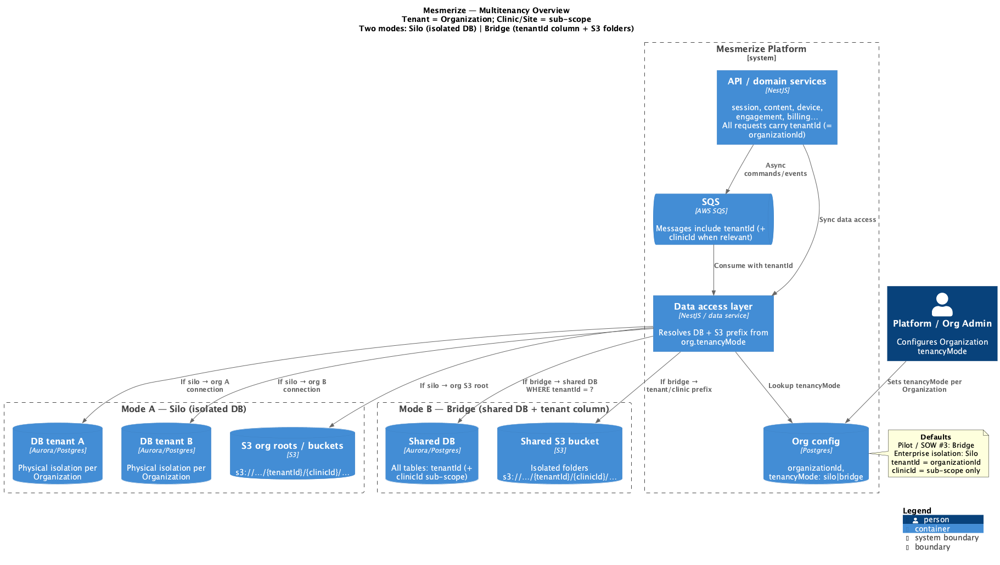
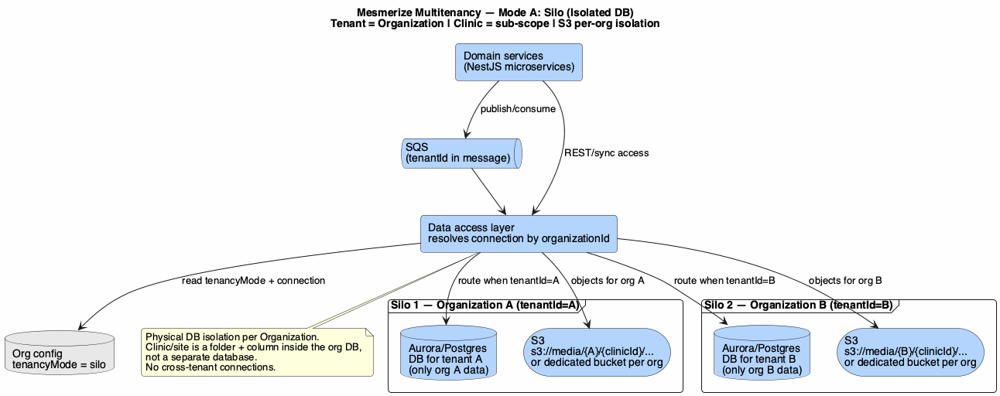
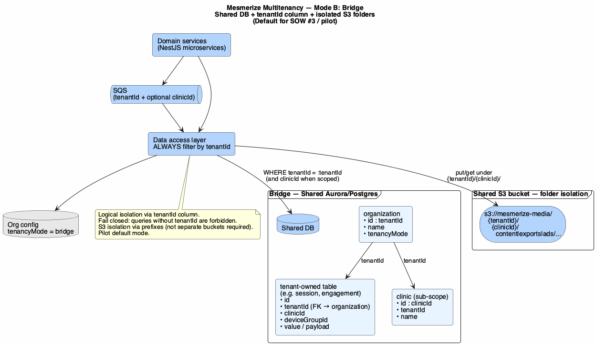

# 11. Multitenancy

| Field | Value |
|-------|-------|
| Chapter ID | `11-multitenancy` |
| SAD mapping | Mesmerize extension |
| Last updated | 2026-07-23 |
| Maturity | Review-ready · 75% |

## Purpose of this chapter

Define how the Content Evidence Platform isolates customer data across healthcare organizations: **Organization = tenant**, clinic/site as sub-scope, and dual storage modes **Silo** (isolated DB) vs **Bridge** (shared DB + `tenantId` + S3 folders). Claims are tagged Confirmed / Inferred / Proposed / Unknown from ADR-013 (MT-1–MT-5).

## Narrative

### Tenant boundary

  <strong>Confirmed:</strong> <code>tenantId</code> = <strong><code>organizationId</code></strong>. Clinic/site (<code>clinicId</code> / <code>deviceGroupId</code>) nests <strong>inside</strong> a tenant — not a separate tenancy mode (ADR-013; MT-1, MT-2).

| Concept | Identifier | Role |
|---------|------------|------|
| Tenant | `organizationId` (= `tenantId`) | Isolation boundary for customer data |
| Sub-scope | `clinicId` / `deviceGroupId` | Site / device grouping within one org |
| Mode switch | `tenancyMode: silo \| bridge` | Configurable **per Organization** |

  <strong>Confirmed:</strong> No cross-tenant access in either mode. Multitenancy is <strong>orthogonal</strong> to the zero-PHI rule: tenant-scoped data still must not contain patient identifiers on Mesmerize servers (ADR-013; ADR-002).

### Dual modes — Silo vs Bridge

  <strong>Confirmed:</strong> Platform supports two modes, selectable per Organization (ADR-013; MT-3, MT-4).

| Mode | Database | Object storage (S3) |
|------|----------|---------------------|
| **Silo** (isolated DB) | Dedicated Postgres/Aurora **per Organization** | Org-dedicated bucket **or** org root prefix; paths `{tenantId}/{clinicId}/…` |
| **Bridge** (shared DB) | Shared Postgres/Aurora; **`tenantId` column** on all tenant-owned tables; every query scoped by `tenantId` | Shared bucket; **isolated folders** `{tenantId}/{clinicId}/…` |

**Silo** — physical DB isolation per org. Data-access layer resolves connection + S3 root from org config. Clinic/site remains a folder + column inside the org DB, not a separate database. Requires provisioning automation (DB + secrets + migrations per org).

**Bridge** — logical isolation via mandatory `tenantId` filters in ORM/repositories (**fail closed**). S3 isolation via prefixes; separate buckets not required.

### Pilot default

  <strong>Confirmed:</strong> Default for SOW #3 / pilot = <strong>Bridge</strong> (shared DB + <code>tenantId</code> + S3 folders). <strong>Silo</strong> is available when an Organization requires stronger physical isolation (ADR-013; MT-5).

### Object storage paths

  <strong>Confirmed:</strong> Both modes use S3 path shape <code>{tenantId}/{clinicId}/…</code> (content, exports, ads, etc.). Bridge uses a shared bucket with folder isolation; Silo may use a dedicated bucket or org root prefix with the same path convention (ADR-013).

### Messaging and data-access consequences

  <strong>Confirmed:</strong> Async messages (SQS) <strong>must</strong> carry <code>tenantId</code> (and <code>clinicId</code> when relevant). Data-access / “data service” layer resolves connection + S3 prefix from org tenancy config (Core → SQS → microservice → data access) (ADR-013).

  <strong>Inferred:</strong> Agents and services must not assume a single global schema without <code>tenantId</code> (Bridge) or without org DB routing (Silo) — fail closed on missing tenant context.

  <strong>Unknown:</strong> Concrete Silo provisioning runbook (DB naming, secrets layout, migration orchestration) and whether pilot orgs will ever switch modes after go-live — not specified in ADR-013.

## Diagrams

*Figure 11-1: Multitenancy overview — Organization = tenant; clinic/site = sub-scope; Silo vs Bridge routing via data-access layer (ADR-013).*

*Figure 11-2: Mode A — Silo: dedicated DB per Organization + org-isolated S3; clinic remains sub-scope inside the org (ADR-013; MT-3).*

*Figure 11-3: Mode B — Bridge (pilot default): shared DB with `tenantId` column + shared S3 bucket folders `{tenantId}/{clinicId}/…` (ADR-013; MT-4, MT-5).*

## Evidence

- [ADR-013](../../../docs/adr/013-multitenancy-silo-and-bridge.md) — Dual-mode multitenancy (Silo vs Bridge); MT-1–MT-5
- [ADR-002](../../../docs/adr/002-zero-phi-on-mesmerize-servers.md) — Zero PHI still applies under tenant isolation
- [`docs/adr/README.md`](../../../docs/adr/README.md) — Confirmed decisions MT-1–MT-5
- [`docs/superpowers/specs/2026-07-23-multitenancy-design.md`](../../../docs/superpowers/specs/2026-07-23-multitenancy-design.md) — Design summary
- Diagrams: `output_diagrams/08-multitenancy-overview`, `09-multitenancy-silo`, `10-multitenancy-bridge`

## White spots

  <strong>Unknown:</strong> Silo provisioning automation details (DB + secrets + migrations per org); post-go-live mode-switch policy; exact shared vs dedicated S3 bucket naming for Silo orgs.

  <strong>Proposed:</strong> Fail-closed repository guards and org-config lookup as the single routing point for DB connection + S3 prefix — implementation pattern implied by ADR-013 consequences; not yet a coded standard in this pack.

## Open questions

1. Will any pilot Organization require Silo at go-live, or is Bridge universal for SOW #3?
2. Silo S3: dedicated bucket per org vs single bucket with org root prefix — which is the preferred default?
3. Can an Organization switch `tenancyMode` after data exists, and what migration path is supported?
4. Who owns Silo provisioning runbooks (platform vs customer ops)?
