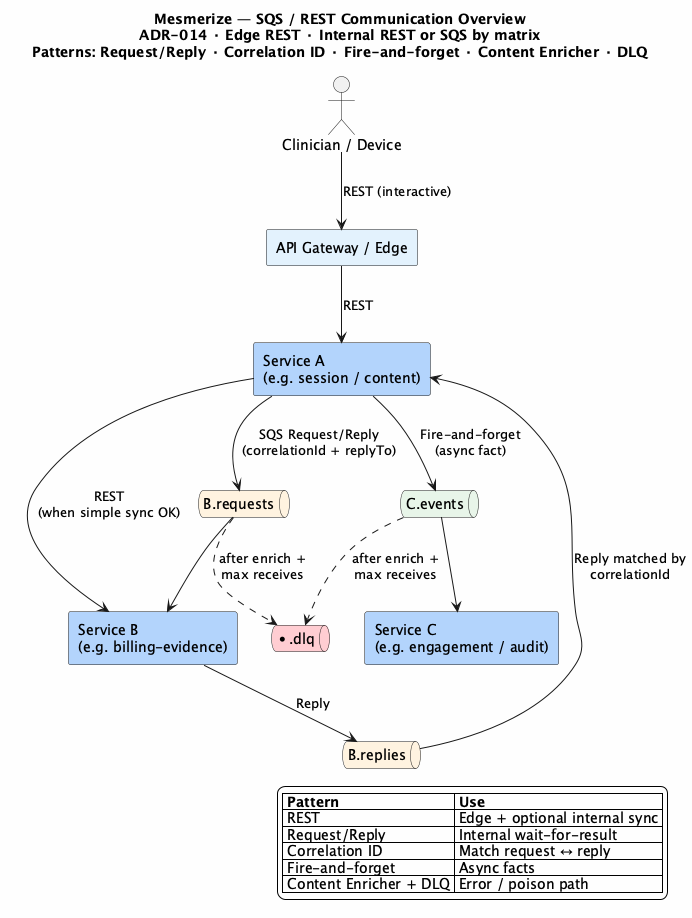
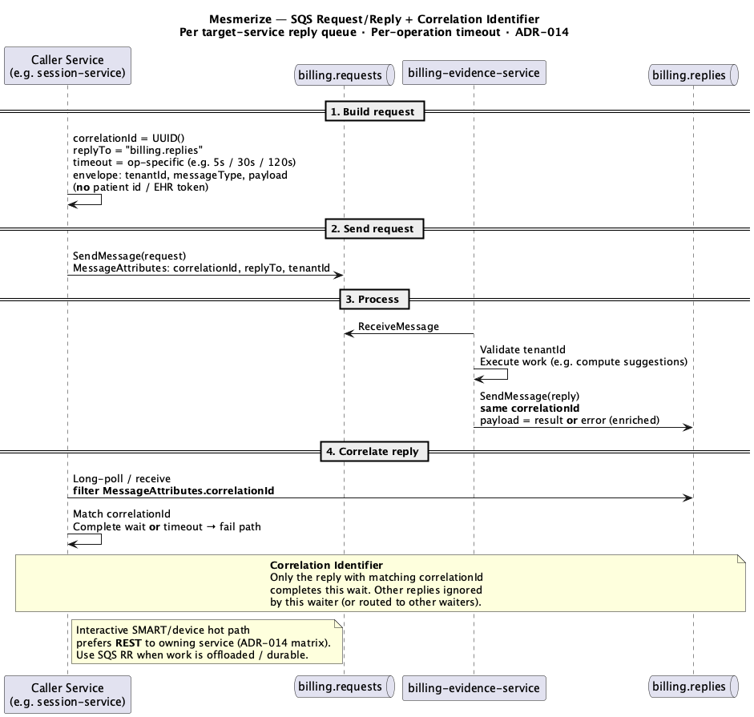
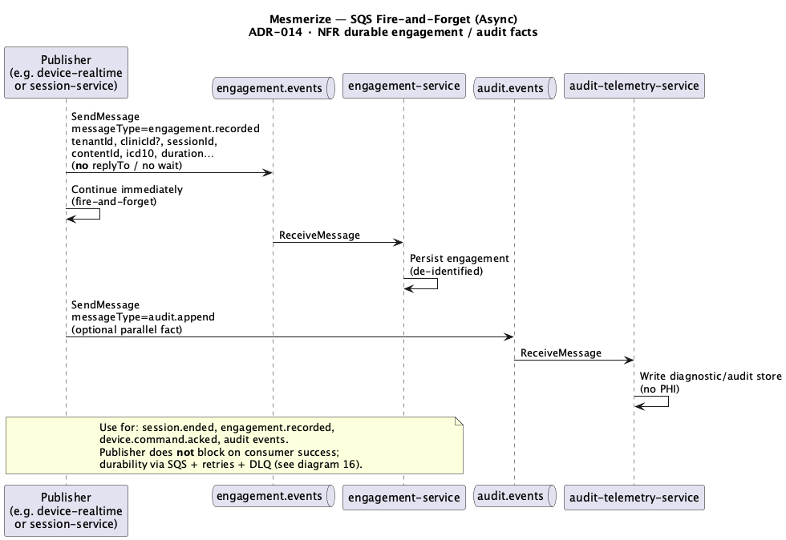
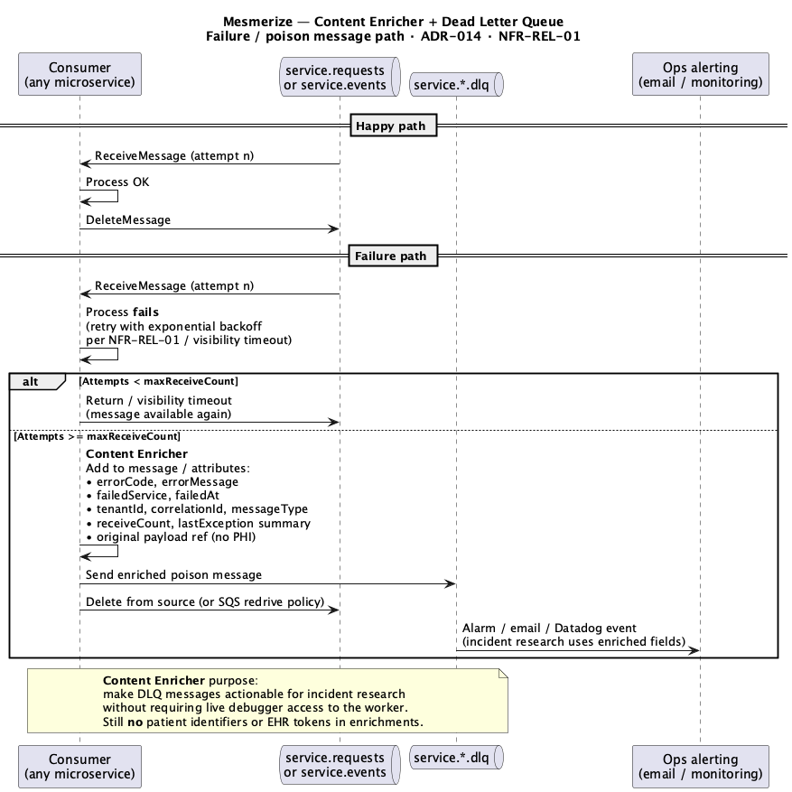

# 12. Messaging & Integration

| Field | Value |
|-------|-------|
| Chapter ID | `12-messaging-and-integration` |
| SAD mapping | Mesmerize extension |
| Last updated | 2026-07-23 |
| Maturity | Review-ready · 75% |

## Purpose of this chapter

Define how the Content Evidence Platform moves work across the edge and between internal services: **REST (and Socket.io) at the interactive edge**, **SQS Request/Reply + correlation** and **fire-and-forget** internally, plus **enricher → DLQ** for poison messages. Also summarize external systems (Athena, Auth0, Esper, CMS, SMS) the platform integrates with. Claims are tagged Confirmed / Inferred / Proposed / Unknown from ADR-014 and PROJECT_CONTEXT.

## Narrative

### Edge vs internal transport

  <strong>Confirmed:</strong> Edge clients (SMART app, devices, Command Center → platform) use <strong>REST</strong>; device realtime uses <strong>Socket.io</strong>. Interactive edge answers (session, recommend, device list) are <strong>not</strong> SQS request/reply when REST to the owning service is sufficient (ADR-014).

  <strong>Confirmed:</strong> Internal service-to-service uses <strong>REST or SQS</strong> per the decision matrix below. All SQS messages carry <code>tenantId</code> (and <code>clinicId</code> when relevant); never EHR tokens or patient identifiers (ADR-014; ADR-013; ADR-002).

| Need | Transport / pattern |
|------|---------------------|
| Interactive edge answer (session, recommend, device list) | REST |
| Caller service needs result from another service | SQS Request/Reply + `correlationId` |
| Emit fact / side effect (engagement, audit, session.ended) | SQS Fire-and-forget |
| Poison / repeated failure | Enrich → DLQ |

### SQS messaging overview

*Figure 12-1: SQS messaging overview — REST edge; internal REST or SQS by matrix; RR, events, and DLQ queues (ADR-014).*

### Request/Reply + correlationId

  <strong>Confirmed:</strong> SQS “synchronous” style = <strong>Request/Reply</strong>: request queue <code>{service}.requests</code>, reply queue <code>{service}.replies</code> (per <strong>target</strong> service), <strong>Correlation Identifier</strong> (<code>correlationId</code>) + <code>replyTo</code>, with timeouts configurable per operation (ADR-014).

*Figure 12-2: SQS Request/Reply — `{service}.requests` / `{service}.replies`, `correlationId` + `replyTo` (ADR-014).*

### Fire-and-forget

  <strong>Confirmed:</strong> Asynchronous style = <strong>fire-and-forget</strong> to <code>{service}.events</code> (or command queues that do not wait) — e.g. engagement, audit, <code>session.ended</code> (ADR-014).

*Figure 12-3: SQS fire-and-forget — emit fact / side effect to `{service}.events` without waiting for a reply (ADR-014).*

### Enricher + Dead Letter Queue

  <strong>Confirmed:</strong> On failure, a <strong>Content Enricher</strong> adds error context to the message; after max receives → <strong>Dead Letter Queue</strong> <code>{queue}.dlq</code>. NFR-REL-01 (backoff) applies to consumers; DLQ is the terminal path after retries (ADR-014).

*Figure 12-4: Content Enricher adds error context; after max receives the message lands on `{queue}.dlq` (ADR-014).*

### Message envelope (minimum)

  <strong>Confirmed:</strong> Minimum envelope fields: <code>messageId</code>, <code>correlationId</code>, <code>replyTo</code>, <code>tenantId</code>, <code>clinicId?</code>, <code>messageType</code>, <code>timestamp</code>, <code>payload</code>, <code>error?</code> (ADR-014).

### External integrations (brief)

| External | Role (PROJECT_CONTEXT) |
|----------|------------------------|
| **athenahealth (Athena)** | Pilot EHR; SMART 3-legged OAuth / EHR launch; Marketplace Developer Console relationship |
| **Auth0** | Command Center admin authentication (+ RBAC later phase) |
| **Esper** | MDM fleet; device token provisioning for exam/waiting-room PWAs |
| **CMS (content)** | Sanity + BioDigital + MJH / Pharmacy Times recommendation corpus |
| **SMS** | Patient/Bridge notification channel (outside VPC; with email) |

  <strong>Inferred:</strong> Externals are invoked over their native HTTPS APIs / SDKs from owning services — not via SQS request/reply at the platform edge.

  <strong>Unknown:</strong> Concrete queue naming inventory per microservice, default RR timeouts, and SMS provider product choice are not fixed in ADR-014.

## Evidence

- [ADR-014](../../../docs/adr/014-sqs-messaging-patterns.md) — REST edge; SQS RR / fire-and-forget / enricher+DLQ; envelope; decision matrix
- [ADR-013](../../../docs/adr/013-multitenancy-silo-and-bridge.md) — `tenantId` on messages
- [ADR-002](../../../docs/adr/002-zero-phi-on-mesmerize-servers.md) — No patient identifiers / EHR tokens on Mesmerize servers
- [`docs/ai/PROJECT_CONTEXT.md`](../../../docs/ai/PROJECT_CONTEXT.md) — Externals (Athena, Auth0, Esper, CMS, SMS)
- Diagrams: `output_diagrams/13-sqs-messaging-overview`, `14-sqs-request-reply-correlation`, `15-sqs-fire-and-forget`, `16-sqs-enricher-dlq`

## White spots

  <strong>Unknown:</strong> Full per-service queue catalog; RR timeout defaults; SMS vendor; exact Auth0/Esper callback and secret layout beyond existing auth/device ADRs.

  <strong>Proposed:</strong> Shared consumer library enforcing envelope + tenant fail-closed + backoff/DLQ policy (implied by ADR-014 consequences; not yet a coded standard in this pack).

## Open questions

Consolidated for Mesmerize decision-making in [Chapter 18 — Assumptions and Open Questions](18-assumptions-and-open-questions.md).

- **A-06** — queue naming + RR timeout default 30s
- **A-07** — SMS US-capable provider (Twilio-class) chosen at build
