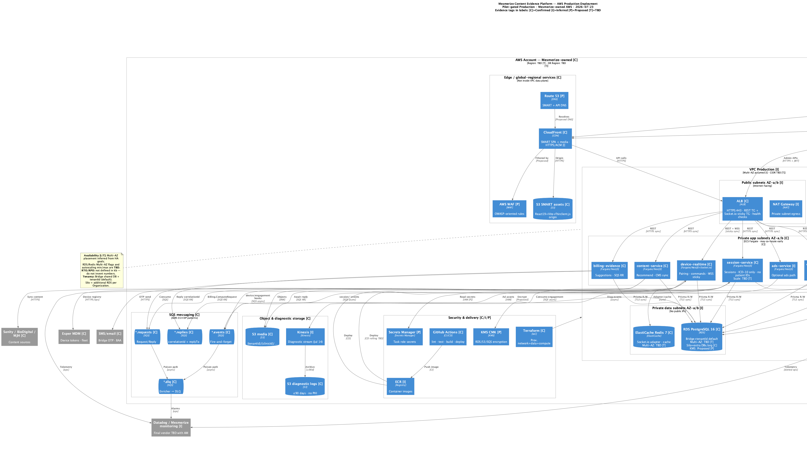

# 13. Deployment & Infrastructure

| Field | Value |
|-------|-------|
| Chapter ID | `13-deployment-and-infrastructure` |
| SAD mapping | Mesmerize extension |
| Last updated | 2026-07-23 |
| Maturity | Draft · 65% (see `../PROGRESS.md`) |

## Purpose of this chapter

Describe the Mesmerize-owned AWS production deployment topology for the Content Evidence Platform: ingress, compute, data, messaging, security controls, CI/CD, and HA/DR posture — with every major claim classified as Confirmed, Inferred, Proposed, or Unknown. This chapter does not invent Region, RTO/RPO, account IDs, or numeric SLOs.

## Narrative

### Environments and ownership

  <strong>Confirmed:</strong> Production and sibling environments run on <strong>Mesmerize-owned AWS</strong> (ADR-010 S12). Topology shape is the same for Dev / Staging / Prod; Staging is PHI-free / Athena sandbox; Prod is pilot-gated (ADR-015; ARCHITECTURE.md cloud section).

Externals remain outside the VPC: athenahealth, Auth0, Esper, Sanity / BioDigital / MJH, SMS/email.

### Ingress

  <strong>Confirmed:</strong> SMART SPA is served via <strong>CloudFront</strong> (S3 origin). API and Socket.io traffic terminate on <strong>ALB</strong> (HTTPS), with a <strong>sticky target group</strong> for <code>device-realtime-service</code> (ADR-015, ADR-007). Admin traffic uses Auth0 then ALB; devices connect with Esper-provisioned device tokens.

  <strong>Proposed:</strong> Route 53 + WAF in front of CloudFront/ALB for production hardening (recommended; not mandated by the ADR-010 component list).

### Compute

  <strong>Confirmed:</strong> Logical <strong>ECS/Fargate</strong> NestJS services: session, content, device-realtime, engagement, billing-evidence, org-identity, audit-telemetry, and optional ads. Early pilot may <strong>co-locate</strong> tasks on one cluster (ADR-015). No Lambda/EKS required by current ADRs.

  <strong>Inferred:</strong> Container images are published to <strong>ECR</strong> (natural registry for ECS; not separately named as a hard stack line item in ADR-010).

### Data stores

  <strong>Confirmed:</strong> <strong>RDS PostgreSQL 16</strong> (Prisma) with Bridge tenancy default (<code>tenantId</code> = organizationId); Silo = additional RDS instance(s) per org, not a different VPC pattern by default (ADR-013). <strong>ElastiCache Redis 7</strong> for Socket.io adapter / cache. <strong>S3</strong> media at <code>{tenantId}/{clinicId}/…</code>; SMART static assets; diagnostic logs with ≤90-day retention.

  <strong>Inferred:</strong> Private app + private data subnets; Multi-AZ VPC/NAT placement for HA goals (ADR-015 multi-AZ reference wording). ACM certificates and IAM task roles for TLS and least-privilege task access.

### Messaging (SQS)

  <strong>Confirmed:</strong> SQS patterns per ADR-014: <code>*.requests</code> / <code>*.replies</code> (request/reply + correlationId), <code>*.events</code> (fire-and-forget), <code>*.dlq</code> (with enricher path). Edge interactive path stays REST, not SQS request/reply.

### Security controls

  <strong>Confirmed:</strong> Zero patient identifiers on Mesmerize servers; EHR FHIR access token remains browser-only (ADR-002 / ADR-005). Auth0 for admin / Command Center; SMART 3-legged OAuth for clinicians.

  <strong>Proposed:</strong> Secrets Manager, KMS CMKs, and WAF as production security controls before secrets sprawl and for OWASP/pen-test Phase 3 posture.

### Observability

  <strong>Confirmed:</strong> Separate engagement vs diagnostic logs (NFR-OPS). Diagnostic retention ≤90 days on S3.

  <strong>Inferred:</strong> Kinesis → S3 diagnostic pipeline (Jul 14 / NFR direction). Datadog appears as the reference monitoring product in ADR-010 S15 — final vendor/config must be confirmed with Mesmerize.

### CI/CD

  <strong>Confirmed:</strong> <strong>GitHub Actions</strong> → build/test → container registry → <strong>ECS</strong> deploy; infrastructure via <strong>Terraform</strong> (ADR-010 S14; ADR-015).

  <strong>Unknown:</strong> Deployment strategy (rolling / blue-green / canary) is TBD — not evidenced in kb or ADRs.

### High availability and DR

Multi-AZ placement is inferred for ALB/ECS/data subnets. Queue buffering, retries, and DLQs support recoverability. Cross-Region DR is not defined.

  <strong>Unknown:</strong> Production <strong>AWS Region</strong> (and optional DR Region) — not documented; do not invent. AWS account ID / org OU structure also undocumented.

  <strong>Unknown:</strong> <strong>RTO</strong> and <strong>RPO</strong> — no kb values; do not invent numeric targets.

  <strong>Unknown:</strong> RDS and ElastiCache <strong>Multi-AZ flags</strong> — not evidenced in IaC (no live Terraform state in this repo).

  <strong>Unknown:</strong> ECS <strong>autoscaling bounds</strong> (min/max per service for pilot vs scale) — qualitative fleet scale only in NFR; no numeric floors/ceilings.

### Component deployment mapping (summary)

| Component | AWS target | Evidence |
|-----------|------------|----------|
| SMART Web App | CloudFront ← S3 | Confirmed |
| NestJS platform services | ECS Fargate (private app) | Confirmed |
| device-realtime | ECS + sticky ALB TG | Confirmed |
| Platform data | RDS PostgreSQL 16 | Confirmed |
| Cache / Socket.io bus | ElastiCache Redis 7 | Confirmed |
| Media / exports | S3 `{tenantId}/{clinicId}/…` | Confirmed |
| Messaging | SQS RR / events / DLQ | Confirmed |
| Admin auth | Auth0 (external) | Confirmed |
| IaC / CI | Terraform + GitHub Actions | Confirmed |
| Container registry | ECR | Inferred |
| Route 53 / WAF / Secrets Manager / KMS | — | Proposed |

## Diagrams

*Figure 13-1: Production deployment package — CloudFront/ALB ingress, ECS/Fargate services, RDS/Redis/S3/SQS, CI/CD, and externals. Prefer this diagram for technical reviews (ADR-015).*

*Figure 13-2: Generic multi-AZ AWS reference with Graphviz AWS icons — same shape for Dev/Staging/Prod; stakeholder overview (ADR-015).*

## Evidence

- [ADR-015](../../../docs/adr/015-aws-deployment-reference.md) — AWS reference deployment topology
- [ADR-010](../../../docs/adr/010-technology-stack.md) — S12–S15 infra / IaC / observability
- [ADR-013](../../../docs/adr/013-multitenancy-silo-and-bridge.md) — Bridge default; Silo extra RDS
- [ADR-014](../../../docs/adr/014-sqs-messaging-patterns.md) — SQS RR / events / DLQ
- [`docs/architecture/deployment/aws-production-deployment.md`](../../../docs/architecture/deployment/aws-production-deployment.md) — production package narrative + matrices
- [`docs/ai/ARCHITECTURE.md`](../../../docs/ai/ARCHITECTURE.md) — Cloud / infra section

## White spots

  <strong>Unknown:</strong> AWS Region / DR Region; RTO / RPO; RDS &amp; Redis Multi-AZ flags; ECS autoscaling min/max; deployment strategy (rolling/blue-green/canary); AWS account ID.

  <strong>Proposed:</strong> Route 53, WAF, Secrets Manager, KMS CMKs as mandatory prod controls — awaiting security architecture sign-off.

  <strong>Inferred:</strong> Final observability vendor (Datadog vs Mesmerize-approved alternative); Kinesis exact topology; ECR as registry.

## Open questions

1. Which AWS Region (and optional DR Region) hosts Production?
2. Dedicated AWS account for Prod vs shared with Staging?
3. Are RDS and ElastiCache Multi-AZ?
4. Required RTO and RPO?
5. ECS autoscaling floors/ceilings per service (pilot vs scale)?
6. Confirm Secrets Manager + KMS + WAF + Route 53 as mandatory?
7. Final observability stack?
8. Deployment strategy: rolling, blue-green, or canary?
9. Is an AWS BAA required given zero-PHI server design?
10. Outbound egress allow-list for Sanity/BioDigital/Auth0/SMS/Esper?
