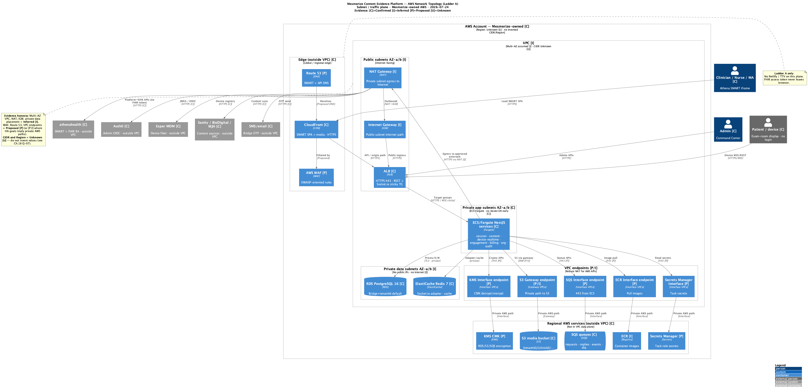
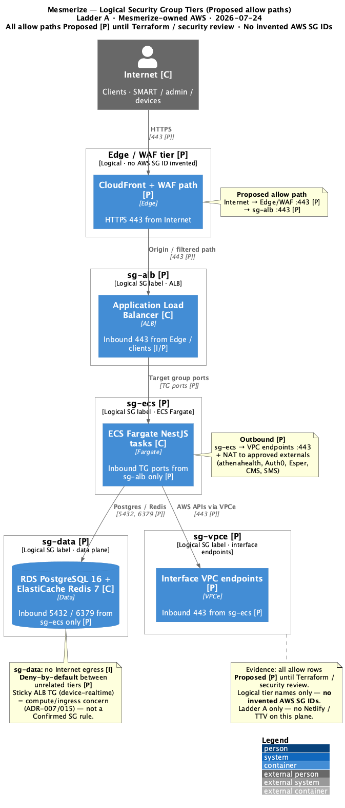

# 13. Deployment & Infrastructure

| Field | Value |
|-------|-------|
| Chapter ID | `13-deployment-and-infrastructure` |
| SAD mapping | Mesmerize extension |
| Last updated | 2026-07-24 |
| Maturity | Review-ready · 75% |

## Purpose of this chapter

Describe the Mesmerize-owned AWS production deployment topology for the Content Evidence Platform: ingress, compute, data, messaging, security controls, and HA/DR posture — with every major claim classified as Confirmed, Inferred, Proposed, or Unknown. Dual delivery ladders (CI/CD) live in [Chapter 17](17-ci-cd.md). This chapter does not invent Region, RTO/RPO, account IDs, or numeric SLOs.

## Narrative

### Environments and ownership

  <strong>Confirmed:</strong> Production and sibling environments run on <strong>Mesmerize-owned AWS</strong> (ADR-010 S12). Topology shape is the same for Dev / Staging / Prod; Staging is PHI-free / Athena sandbox; Prod is pilot-gated (ADR-015; ARCHITECTURE.md cloud section).

Externals remain outside the VPC: athenahealth, Auth0, Esper, Sanity / BioDigital / MJH, SMS/email.

### Ingress

  <strong>Confirmed:</strong> SMART SPA is served via <strong>CloudFront</strong> (S3 origin). API and Socket.io traffic terminate on <strong>ALB</strong> (HTTPS), with a <strong>sticky target group</strong> for <code>device-realtime-service</code> (ADR-015, ADR-007). Admin traffic uses Auth0 then ALB; devices connect with Esper-provisioned device tokens.

  <strong>Proposed:</strong> Route 53 + WAF in front of CloudFront/ALB for production hardening (recommended; not mandated by the ADR-010 component list).

### Network topology

DevOps network plane for **Ladder A** (platform AWS) only: VPC / subnet / edge / egress and logical security-group tiers. Claims are tagged Confirmed / Inferred / Proposed / Unknown — do **not** invent CIDR blocks or Region as Confirmed. Ladder B (Netlify / TTV) is out of scope for this plane; see [Chapter 17](17-ci-cd.md).

*Figure 13-3: AWS network topology — edge (CloudFront Confirmed; Route 53 / WAF Proposed), Multi-AZ VPC Inferred, public / private app / private data subnets, VPC endpoints Proposed/Inferred, NAT egress to approved externals. CIDR and Region Unknown (ADR-015).*

Public subnets host ALB (Confirmed) and NAT (Inferred). Private app subnets run ECS/Fargate NestJS services (Confirmed; early co-locate OK). Private data subnets hold RDS PostgreSQL 16 and ElastiCache Redis 7 (Confirmed). S3 media is regional (outside VPC). Sticky ALB target group for `device-realtime-service` remains an ingress/compute concern (ADR-007 / ADR-015), not a Confirmed SG rule dump.

*Figure 13-4: Logical security-group tiers — Proposed allow paths until Terraform / security review confirms. No invented AWS SG IDs.*

| Tier | Members | Proposed inbound | Source |
|------|---------|------------------|--------|
| Edge / WAF | CloudFront + WAF path | HTTPS 443 | Internet |
| sg-alb | Application Load Balancer | 443 | CloudFront / clients **[I/P]** |
| sg-ecs | ECS Fargate tasks | App ports via target groups (typically 443/container) | sg-alb only |
| sg-data | RDS, Redis | 5432 (Postgres), 6379 (Redis) | sg-ecs only |
| sg-vpce | Interface VPC endpoints | 443 | sg-ecs |

**Outbound (Proposed):** sg-ecs → VPC endpoints + NAT to approved externals; sg-data **no Internet** **[I]**; deny-by-default between unrelated tiers. All allow rows are **Proposed** until confirmed.

  <strong>Inferred:</strong> Multi-AZ VPC, NAT Gateway, and private data-subnet placement for HA goals (ADR-015 wording).

  <strong>Proposed:</strong> WAF, Route 53, VPC endpoints (S3 gateway; SQS / ECR / Secrets Manager / KMS interface), and the SG tier allow matrix above.

  <strong>Unknown:</strong> VPC <strong>CIDR</strong> blocks and production <strong>AWS Region</strong> — not documented; do not invent. Region decision tracked as <strong>Q-07</strong> in <a href="18-assumptions-and-open-questions.md">Chapter 18</a>.

### Compute

  <strong>Confirmed:</strong> Logical <strong>ECS/Fargate</strong> NestJS services: session, content, device-realtime, engagement, billing-evidence, org-identity, audit-telemetry, and optional ads. Early pilot may <strong>co-locate</strong> tasks on one cluster (ADR-015). No Lambda/EKS required by current ADRs.

  <strong>Inferred:</strong> Container images are published to <strong>ECR</strong> (natural registry for ECS; not separately named as a hard stack line item in ADR-010).

### Data stores

  <strong>Confirmed:</strong> <strong>RDS PostgreSQL 16</strong> (Prisma) with Bridge tenancy default (<code>tenantId</code> = organizationId); Silo = additional RDS instance(s) per org, not a different VPC pattern by default (ADR-013). <strong>ElastiCache Redis 7</strong> for Socket.io adapter / cache. <strong>S3</strong> media at <code>{tenantId}/{clinicId}/…</code>; SMART static assets; diagnostic logs with ≤90-day retention.

  <strong>Inferred:</strong> Private app + private data subnets; Multi-AZ VPC/NAT placement for HA goals (ADR-015 multi-AZ reference wording). ACM certificates and IAM task roles for TLS and least-privilege task access.

### Messaging (SQS)

  <strong>Confirmed:</strong> SQS patterns per ADR-014: <code>*.requests</code> / <code>*.replies</code> (request/reply + correlationId), <code>*.events</code> (fire-and-forget), <code>*.dlq</code> (with enricher path). Edge interactive path stays REST, not SQS request/reply.

### Security controls

  <strong>Confirmed:</strong> Zero patient identifiers on Mesmerize servers; EHR FHIR access token remains browser-only (ADR-002 / ADR-005). Auth0 for admin / Command Center; SMART 3-legged OAuth for clinicians.

  <strong>Proposed:</strong> Secrets Manager, KMS CMKs, and WAF as production security controls before secrets sprawl and for OWASP/pen-test Phase 3 posture.

### Observability

  <strong>Confirmed:</strong> Separate engagement vs diagnostic logs (NFR-OPS). Diagnostic retention ≤90 days on S3.

  <strong>Inferred:</strong> Kinesis → S3 diagnostic pipeline (Jul 14 / NFR direction). Datadog appears as the reference monitoring product in ADR-010 S15 — final vendor/config must be confirmed with Mesmerize.

### Dual delivery ladders (summary)

Platform (AWS) and device/PWA delivery are **separate ladders** ([ADR-016](../../../docs/adr/016-git-branching-and-delivery-ladders.md)). **Ladder A:** GitHub Actions → ECR → ECS + Terraform. **Ladder B:** Netlify (web preview only) ≠ device path; human-triggered TTV filesync + Esper. Full branching, CI checks, diagrams 19/20, and open deploy-strategy questions: **[Chapter 17 — CI/CD](17-ci-cd.md)**.

### High availability and DR

Multi-AZ placement is inferred for ALB/ECS/data subnets. Queue buffering, retries, and DLQs support recoverability. Cross-Region DR is not defined.

  <strong>Unknown:</strong> Production <strong>AWS Region</strong> (and optional DR Region) — not documented; do not invent. AWS account ID / org OU structure also undocumented.

  <strong>Unknown:</strong> <strong>RTO</strong> and <strong>RPO</strong> — no kb values; do not invent numeric targets.

  <strong>Unknown:</strong> RDS and ElastiCache <strong>Multi-AZ flags</strong> — not evidenced in IaC (no live Terraform state in this repo).

  <strong>Unknown:</strong> ECS <strong>autoscaling bounds</strong> (min/max per service for pilot vs scale) — qualitative fleet scale only in NFR; no numeric floors/ceilings.

### Component deployment mapping (summary)

| Component | AWS target | Evidence |
|-----------|------------|----------|
| SMART Web App | CloudFront ← S3 | Confirmed |
| NestJS platform services | ECS Fargate (private app) | Confirmed |
| device-realtime | ECS + sticky ALB TG | Confirmed |
| Platform data | RDS PostgreSQL 16 | Confirmed |
| Cache / Socket.io bus | ElastiCache Redis 7 | Confirmed |
| Media / exports | S3 `{tenantId}/{clinicId}/…` | Confirmed |
| Messaging | SQS RR / events / DLQ | Confirmed |
| Admin auth | Auth0 (external) | Confirmed |
| IaC / CI (Ladder A) | Terraform + GitHub Actions → ECR → ECS | Confirmed direction — see [ch.17](17-ci-cd.md) |
| Device/PWA release (Ladder B) | Netlify web preview; manual TTV filesync; Esper tags | Confirmed (PWA) — see [ch.17](17-ci-cd.md) |
| Container registry | ECR | Inferred |
| Route 53 / WAF / Secrets Manager / KMS | — | Proposed |

## Diagrams

*Figure 13-1: Production deployment package — CloudFront/ALB ingress, ECS/Fargate services, RDS/Redis/S3/SQS, CI/CD, and externals. Prefer this diagram for technical reviews (ADR-015).*

*Figure 13-2: Generic multi-AZ AWS reference with Graphviz AWS icons — same shape for Dev/Staging/Prod; stakeholder overview (ADR-015).*

*Figure 13-3: AWS network topology — VPC / AZ / subnet / edge / endpoints / egress (Ladder A). CIDR and Region Unknown.*

*Figure 13-4: Logical security-group tiers with Proposed allow paths (no invented SG IDs).*

## Evidence

- [Chapter 17 — CI/CD](17-ci-cd.md) — dual delivery ladders (full narrative)
- [ADR-016](../../../docs/adr/016-git-branching-and-delivery-ladders.md) — dual delivery ladders decision
- [ADR-015](../../../docs/adr/015-aws-deployment-reference.md) — AWS reference deployment topology (Ladder A)
- [ADR-010](../../../docs/adr/010-technology-stack.md) — S12–S15 infra / IaC / observability
- [ADR-013](../../../docs/adr/013-multitenancy-silo-and-bridge.md) — Bridge default; Silo extra RDS
- [ADR-014](../../../docs/adr/014-sqs-messaging-patterns.md) — SQS RR / events / DLQ
- [`docs/architecture/deployment/aws-production-deployment.md`](../../../docs/architecture/deployment/aws-production-deployment.md) — production package narrative + matrices
- [`docs/ai/ARCHITECTURE.md`](../../../docs/ai/ARCHITECTURE.md) — Cloud / infra section
- [`output_diagrams/21-aws-network-topology.puml`](../../output_diagrams/21-aws-network-topology.puml) / [`.png`](../../output_diagrams/21-aws-network-topology.png) — Ladder A network topology
- [`output_diagrams/22-aws-security-group-tiers.puml`](../../output_diagrams/22-aws-security-group-tiers.puml) / [`.png`](../../output_diagrams/22-aws-security-group-tiers.png) — logical SG tiers (Proposed allows)

## White spots

  <strong>Unknown:</strong> AWS Region / DR Region (<strong>Q-07</strong>); VPC <strong>CIDR</strong>; RTO / RPO; RDS &amp; Redis Multi-AZ flags; ECS autoscaling min/max; AWS account ID. CI/CD unknowns (deploy strategy, platform branch promotion) — see [Chapter 17](17-ci-cd.md). Region open question: <a href="18-assumptions-and-open-questions.md">Chapter 18 — Q-07</a>.

  <strong>Proposed:</strong> Route 53, WAF, Secrets Manager, KMS CMKs as mandatory prod controls — awaiting security architecture sign-off.

  <strong>Inferred:</strong> Final observability vendor (Datadog vs Mesmerize-approved alternative); Kinesis exact topology; ECR as registry.

## Open questions

Consolidated for Mesmerize decision-making in [Chapter 18 — Assumptions and Open Questions](18-assumptions-and-open-questions.md).

- **A-01**, **A-02**, **A-03** — Region class, Multi-AZ, rolling deploys
- **Q-06**, **Q-07** — RTO/RPO; primary/DR Region
- Related: **Q-03**, **Q-09**; CI/CD promotion **Q-13** / [Chapter 17](17-ci-cd.md)

