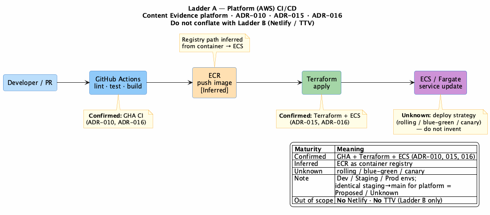
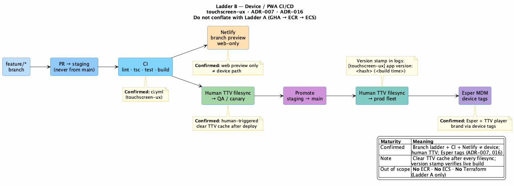

# 17. CI/CD

| Field | Value |
|-------|-------|
| Chapter ID | `17-ci-cd` |
| SAD mapping | Mesmerize extension (Appendix F) |
| Last updated | 2026-07-23 |
| Maturity | Review-ready · 75% |

## Purpose of this chapter

Describe **dual delivery ladders** for the Content Evidence Platform: **Ladder A** (platform AWS — NestJS/ECS) and **Ladder B** (device/PWA — touchscreen-ux / extend-PWA). Branching, PR conventions, CI checks, and release paths are classified Confirmed / Inferred / Proposed / Unknown. This chapter does **not** invent platform deploy strategy (rolling / blue-green / canary) and does **not** claim Netlify or TelemetryTV (TTV) filesync for NestJS/ECS services ([ADR-016](../../../docs/adr/016-git-branching-and-delivery-ladders.md)).

Runtime AWS topology remains in [Chapter 13](13-deployment-and-infrastructure.md); this chapter owns delivery narrative only.

## Branching / PRs

  <strong>Confirmed:</strong> For <strong>touchscreen-ux (device PWA)</strong>: branch ladder <code>feature → staging → main</code>; all PRs target <code>staging</code>; never start from <code>main</code>; prefixes <code>content/</code>, <code>feat/</code>, <code>fix/</code>, <code>chore/</code>, <code>refactor/</code>, <code>docs/</code>; content vs code on separate branches/PRs; rebase + <code>--force-with-lease</code> preferred; merge commits (not squash); Conventional Commit <strong>PR titles</strong>; <code>staging</code> protected (ADR-016; touchscreen-ux DevOps extract).

  <strong>Proposed:</strong> Content Evidence <strong>platform</strong> repos adopt the same org branch/PR conventions. Confirmed today only for touchscreen-ux until platform repos adopt the ladder (ADR-016).

  <strong>Unknown:</strong> Whether platform Staging/Prod promotion uses identical <code>staging</code>/<code>main</code> git semantics as Ladder B — open until ops runbook or superseding ADR.

## Ladder A — Platform (AWS)

  <strong>Confirmed:</strong> <strong>Ladder A</strong> direction: <strong>GitHub Actions</strong> → <strong>ECR</strong> (inferred registry) → <strong>ECS/Fargate</strong> + <strong>Terraform</strong> (ADR-010 S14; ADR-015; ADR-016). Environments: Dev / Staging / Prod on Mesmerize-owned AWS. Do <strong>not</strong> draw or describe Ladder A as Netlify or TTV filesync.

  <strong>Inferred:</strong> Container images publish to <strong>ECR</strong> as the natural registry for ECS (not separately named as a hard stack line item in ADR-010).

  <strong>Unknown:</strong> Platform deployment strategy (rolling / blue-green / canary) — not evidenced in kb or ADRs; do not invent.

*Figure 17-1: Ladder A — Developer/PR → GitHub Actions (lint · test · build) → ECR → Terraform → ECS/Fargate. Deploy strategy Unknown. No Netlify/TTV (ADR-016).*

## Ladder B — Device / PWA

  <strong>Confirmed:</strong> <strong>Ladder B</strong> for touchscreen-ux / extend-PWA: <strong>Netlify</strong> = web-only branch preview (not the device path); device path = human-triggered <strong>TTV filesync</strong>; merge to <code>staging</code> = QA/canary devices; promote <code>staging → main</code> = production fleet; Esper MDM + TTV player tags; clear TTV cache after deploy; version stamp verify on boot (ADR-007; ADR-016; touchscreen-ux DevOps extract).

*Figure 17-2: Ladder B — feature → PR to staging → CI → fork (Netlify web-only | human TTV → QA) → promote staging→main → human TTV → production fleet → Esper tags (ADR-016).*

## CI checks

| Product | Checks | Evidence |
|---------|--------|----------|
| **Platform (Ladder A)** | GitHub Actions: lint · test · build → image → ECS (direction) | Confirmed direction (ADR-010, ADR-015, ADR-016) |
| **touchscreen-ux (Ladder B)** | `ci.yml` — lint, `tsc -b`, vitest, production build | Confirmed (extract / DEPLOYMENT.md) |
| **touchscreen-ux** | `check-content-links.yml` — nav links / orphan JSON under `src/data/**` | Confirmed |
| **touchscreen-ux** | `contrast-audit.yml` — WCAG contrast (Playwright + axe) | Confirmed |
| **touchscreen-ux** | `generate-whitelabel.yml` — regenerate on `whitelabel.json` change | Confirmed (PWA authoring; not a platform requirement) |
| **touchscreen-ux** | `check-ingest-endpoint.yml` — analytics ingest probe | Confirmed |

  <strong>Proposed:</strong> Platform monorepo CI adopts the core gate shape (parallel lint · typecheck · test · build; PR template; CODEOWNERS) documented in <a href="../../../docs/ci-templates/">docs/ci-templates/</a> (adoption matrix + tool-agnostic stubs sourced from touchscreen-ux Confirmed <code>.github</code>). Exact <em>live</em> NestJS workflow inventory is not yet frozen in a platform repo.

## Evidence

- [ADR-016](../../../docs/adr/016-git-branching-and-delivery-ladders.md) — dual delivery ladders; branching Confirmed (PWA) / Proposed (platform)
- [`kb/customer-reference/touchscreen-ux-devops-extract.md`](../../../kb/customer-reference/touchscreen-ux-devops-extract.md) — Ladder B / org branching / CI extract
- [ADR-007](../../../docs/adr/007-extend-pwa-server-mediated-devices.md) — extend PWA; Esper / device path
- [ADR-010](../../../docs/adr/010-technology-stack.md) — Terraform + GitHub Actions; ECS/Fargate (S14)
- [ADR-015](../../../docs/adr/015-aws-deployment-reference.md) — AWS reference deployment (Ladder A topology)
- [Chapter 13](13-deployment-and-infrastructure.md) — runtime AWS topology (pointer)
- [`docs/ci-templates/`](../../../docs/ci-templates/) — Ladder A CI template pack + adoption matrix (Proposed)

## White spots

  <strong>Unknown:</strong> Platform deployment strategy (rolling / blue-green / canary); identical platform <code>staging</code>/<code>main</code> promotion semantics vs Ladder B; exact live platform GitHub Actions inventory in a platform monorepo (Proposed gate shape documented in docs/ci-templates/).

  <strong>Proposed:</strong> Platform repos adopt touchscreen-ux branch/PR conventions (ADR-016).

  <strong>Inferred:</strong> ECR as container registry for Ladder A.

## Open questions

Consolidated for Mesmerize decision-making in [Chapter 18 — Assumptions and Open Questions](18-assumptions-and-open-questions.md).

- **A-03**, **A-04** — rolling deploy; `feature → staging → main` for platform
- **Q-13** — who promotes Staging → Prod and with what gates
- Engineering follow-up (not a Mesmerize Q-row): package-manager / Node pin TODOs in [`docs/ci-templates/workflows/ci.yml`](../../../docs/ci-templates/workflows/ci.yml)
