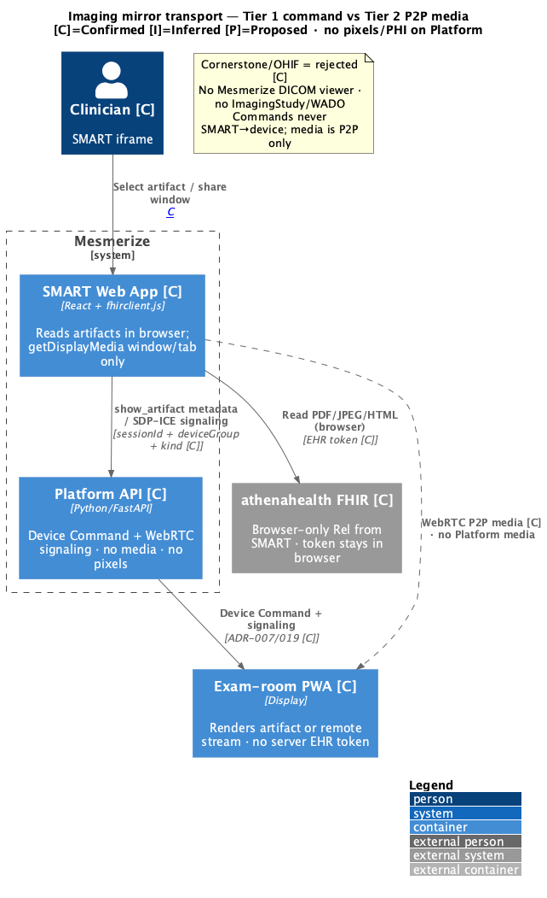
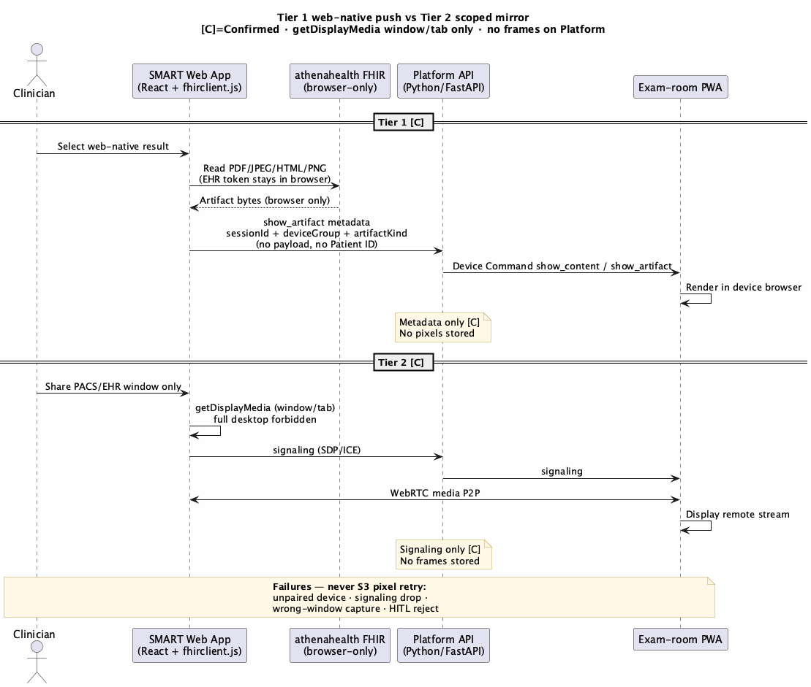

# 20. Exam-Room Imaging Mirror

| Field | Value |
|-------|-------|
| Chapter ID | `20-exam-room-imaging-mirror` |
| SAD mapping | Mesmerize extension (appendix) |
| Last updated | 2026-08-19 |
| Maturity | Review-ready |

## Purpose of this chapter

State the **exam-room imaging display and transport** architecture for the athenahealth pilot: **Tier 1** web-native artifact push and **Tier 2** window/tab-scoped WebRTC mirror. Evidence capture and HITL write-back live in [Chapter 19](19-imaging-mirror-evidence-addendum.md). This chapter owns **data types**, **invariants**, **sequences**, **errors**, and **test fixtures**.

Audience: Mesmerize architecture / compliance reviewers and Newfire delivery. Do **not** treat the customer prebuild imaging-mirror chapter as the SAD spine. Platform runtime is **Python / FastAPI** ([ADR-017](../../../docs/adr/017-python-platform-backend.md)) — not NestJS.

  <strong>Confirmed:</strong> WebRTC signaling and Device Command for imaging display are <strong>this pack’s</strong> decision (<a href="../../../docs/adr/019-exam-room-imaging-display-and-evidence.md">ADR-019</a>, decision #20; <a href="../../../docs/adr/007-extend-pwa-server-mediated-devices.md">ADR-007</a>). They are <strong>not</strong> a Mesmerize-signed <code>INFRASTRUCTURE.md</code> <code>D-xx</code>. Customer device transport remains <strong>explicitly open</strong> on that register.

## Narrative

### Provenance (non-canonical)

Earlier exam-room imaging writing lives outside this pack as brainstorm only:

- Local pointer in the customer decision repo: [`customer-kb/docs/prebuild-proposal/09-EXAM-ROOM-IMAGING-MIRROR-ARCHITECTURE.md`](../../../customer-kb/docs/prebuild-proposal/09-EXAM-ROOM-IMAGING-MIRROR-ARCHITECTURE.md)

  <strong>Confirmed:</strong> That file is <strong>non-canonical</strong> for this SAD (data-type names only as input). Binding rules are <a href="../../../docs/adr/019-exam-room-imaging-display-and-evidence.md">ADR-019</a>. <code>docs/prebuild-proposal/</code> is not settled customer architecture (<a href="../../../docs/adr/018-customer-decision-repo-second-kb.md">ADR-018</a>). This rewrite: <strong>no Mesmerize DICOM viewer</strong>; <strong>P2P media</strong>; Platform <strong>signaling + Device Command</strong> only; <strong>zero PHI / pixels</strong> on Mesmerize servers.

### Five data types (“imaging” is not one thing)

Four rows are web-native US Core artifacts (PDF / HTML / JPEG / PNG / structured). The fifth is raw DICOM — a **minority** case that **Mesmerize does not render**.

| What the clinician shows | FHIR (browser read) | Native format | Rendered by Mesmerize? |
|--------------------------|---------------------|---------------|------------------------|
| Radiology **report** (findings) | `DiagnosticReport.presentedForm` | PDF / HTML | Yes — Tier 1 |
| **Lab results** | `Observation` / `DiagnosticReport` | structured / PDF | Yes — Tier 1 |
| **Scanned docs**, referrals, outside records | `DocumentReference` | PDF / image | Yes — Tier 1 |
| **Clinical photos**, ultrasound stills, derived images | `Media` | JPEG / PNG | Yes — Tier 1 |
| **Raw CT/MRI/X-ray pixel data** | `ImagingStudy` → DICOMweb / WADO-RS | DICOM (in a PACS) | **No — not rendered by us** |

  <strong>Confirmed:</strong> v1 does <strong>not</strong> add <code>ImagingStudy</code>, DICOMweb, or WADO (<a href="../../../docs/adr/019-exam-room-imaging-display-and-evidence.md">ADR-019</a>; <a href="../../../docs/adr/005-smart-oauth-ehr-launch-mvp-scopes.md">ADR-005</a>; <a href="../../../docs/adr/011-do-not-build.md">ADR-011</a> DNB-9). If the clinician must show true DICOM pixels, they share the <strong>EHR/PACS viewer window or tab</strong> (Tier 2). Mesmerize never parses DICOM.

  <strong>Proposed:</strong> Exact additive FHIR <strong>read</strong> scope strings until athena sandbox ratification (<strong>Q-16</strong>): <code>patient/DiagnosticReport.read</code>, <code>patient/DocumentReference.read</code>, <code>patient/Media.read</code>, <code>patient/Observation.read</code>. Intent is Confirmed in ADR-019 / ADR-005; SAD tags the strings Proposed.

### Invariants P1–P4

These hold for every imaging tier. They map to existing ADRs — they are not a new product register.

| ID | Invariant | Binding ADR |
|----|-----------|-------------|
| **P1** | **Thin device.** The exam-room PWA is a renderer/receiver: it displays a web artifact or a remote stream. It never parses DICOM, imports no DICOM library, and holds no PHI at rest. Commands arrive only via Platform Device Command API. | [ADR-007](../../../docs/adr/007-extend-pwa-server-mediated-devices.md) (extend PWA; server-mediated devices); [ADR-019](../../../docs/adr/019-exam-room-imaging-display-and-evidence.md) |
| **P2** | **No Mesmerize DICOM library / viewer.** Diagnostic rendering, if it happens, is in the EHR’s own certified PACS/EHR viewer, which we **mirror** (Tier 2). No Cornerstone, OHIF, or equivalent as a Mesmerize component. | ADR-019; [ADR-011](../../../docs/adr/011-do-not-build.md) **DNB-9** |
| **P3** | **Zero PHI / pixels on Mesmerize servers.** No patient identifiers, no imaging bytes in RDS, S3, or logs. Platform receives opaque session + device group + artifact **kind / opaque id** (or signaling). Media is **P2P**. The device does not use a **server-held** EHR token. | [ADR-002](../../../docs/adr/002-zero-phi-on-mesmerize-servers.md); ADR-019 |
| **P4** | **Non-diagnostic posture.** Mesmerize is a patient-facing **display extension**, not a diagnostic image-management device. It never asserts a reading. | ADR-019 (FDA / non-diagnostic exam-room display) |

  <strong>Confirmed:</strong> <strong>SMART never talks to devices for commands.</strong> Device Command and WebRTC <strong>signaling</strong> go through the Platform API (<strong>Python / FastAPI</strong>). <strong>Media is P2P</strong> (clinician browser ↔ exam-room PWA). There is no SMART↔device application command channel and no NestJS imaging service.

### Tier 1 — web-native artifact push (sequence)

Default path for rows 1–4. Matches Figure 20-2 (upper sequence).

1. Clinician selects a web-native result in the SMART app (React + `fhirclient.js`).
2. SMART reads PDF / JPEG / HTML / PNG (or structured labs) from **athenahealth FHIR in the browser**. The EHR token **stays in the browser**; Platform never sees it.
3. Artifact bytes remain in the clinician browser. SMART sends **`show_artifact` metadata** to Platform: opaque `sessionId` + `deviceGroup` + `artifactKind` — **no payload, no Patient ID**.
4. Platform (**Python / FastAPI**) issues **Device Command** `show_content` / `show_artifact` to the paired exam-room PWA ([ADR-007](../../../docs/adr/007-extend-pwa-server-mediated-devices.md)).
5. The PWA renders in the **device browser**. Platform stores **metadata only** — no pixels.

  <strong>Confirmed:</strong> Tier 1 is <strong>command metadata only</strong> on Platform. De-identified <code>imaging_session</code> evidence (concept Confirmed; code name TBD) is owned by <a href="19-imaging-mirror-evidence-addendum.md">Chapter 19</a>.

### Tier 2 — window/tab-scoped WebRTC mirror (sequence)

Path when the clinician must show pixels that only exist in the EHR/PACS viewer (including raw DICOM that we do not render). Matches Figure 20-2 (lower sequence).

1. Clinician chooses **share PACS/EHR window only** in SMART.
2. SMART calls **`getDisplayMedia` scoped to window/tab**. **Full-desktop share is forbidden.**
3. SMART ↔ Platform: **signaling only** (SDP / ICE). Platform forwards signaling to the exam-room PWA. Platform does **not** relay, store, or log media frames.
4. **WebRTC media is P2P** (SMART browser ↔ device). The PWA displays the remote stream.

  <strong>Confirmed:</strong> Platform is <strong>signaling only</strong> for Tier 2. No frames on Platform. Signaling in this SAD is ADR-019 — <strong>not</strong> a customer <code>D-xx</code>.

### Tier 3 — Cornerstone / OHIF — rejected / do-not-build

Fetch raw DICOM via WADO-RS and render it in a Mesmerize-built viewer (Cornerstone.js, OHIF, or any Mesmerize DICOM parser) is **rejected**.

  <strong>Confirmed:</strong> <strong>Tier 3 = do-not-build</strong> (ADR-019; ADR-011 DNB-9). No Mesmerize DICOM viewer box in the C4 model (see Figure 20-1 note). No ImagingStudy / WADO pipeline. No “fallback” that stands up Cornerstone on the device or on Platform.

### Errors — never retry pixels onto S3

Failures fail **without** placing imaging bytes on Mesmerize object storage, RDS, or logs.

| Failure | What happens | Must not happen |
|---------|--------------|-----------------|
| **Unpaired device** | Device Command has no target; clinician is told to pair/select ([ADR-007](../../../docs/adr/007-extend-pwa-server-mediated-devices.md)). Session metadata may record the miss. | Buffer or upload pixels to S3 “until a device appears” |
| **Signaling drop** | Tier 2 WebRTC does not start or tears down; PWA does not display a stream. | Fall back to uploading frames or a recording to S3 / Platform |
| **Wrong-window share** | Capture is window/tab only; if the clinician shares the wrong window, abort / recapture. Full desktop is forbidden. | Persist captured frames on Platform to “debug” the share |
| **HITL reject** | Physician declines write-back. Platform **keeps** the de-identified `imaging_session` as SoR ([Chapter 19](19-imaging-mirror-evidence-addendum.md)); EHR DocumentReference is not written. | Dump pixels to S3 as a consolation copy of “what was shown” |

  <strong>Confirmed:</strong> <strong>Never retry pixels onto S3.</strong> Object storage is not an imaging relay, not a retry buffer, and not a HITL-reject archive (ADR-002; ADR-019).

### Testing

  <strong>Confirmed:</strong> Fixtures are <strong>synthetic PDFs and JPEGs</strong> (and synthetic HTML/PNG as needed). <strong>No real PHI</strong>, no real patient DICOM studies, no production chart exports in CI or local packs. Tests assert: EHR token never in Platform requests; command payloads carry session / device group / kind only; no pixel bytes on API or logs; <code>getDisplayMedia</code> is not exercised as full-desktop share.

SMART sandbox ratification of read-scope **strings** remains **Q-16**. Pairing and Device Command contract tests stay on the existing device path (UC5–UC6): command via Platform, not SMART→device.

## Diagrams

*Figure 20-1: C4 — Clinician SMART (React + fhirclient.js) reads athena FHIR in the browser; Platform API (Python/FastAPI) does Device Command + WebRTC signaling only; exam-room PWA renders; WebRTC media is P2P (dashed). No pixels/PHI on Platform. Cornerstone/OHIF rejected — no Mesmerize DICOM viewer (ADR-019).*

*Figure 20-2: Tier 1 — select result → browser FHIR read → `show_artifact` metadata → Device Command → PWA render (no pixels stored). Tier 2 — share window/tab only → SDP/ICE signaling via Platform → WebRTC P2P → PWA stream (no frames stored). Failures never S3 pixel retry (ADR-019).*

## Evidence

- [ADR-019](../../../docs/adr/019-exam-room-imaging-display-and-evidence.md) — Tier 1 + Tier 2 in-scope; no DICOM viewer; P2P media; signaling + Device Command; zero pixels on Platform
- [ADR-002](../../../docs/adr/002-zero-phi-on-mesmerize-servers.md) — no patient identifiers on Mesmerize servers
- [ADR-007](../../../docs/adr/007-extend-pwa-server-mediated-devices.md) — extend PWA; SMART never commands devices directly; Device Command API
- [ADR-011](../../../docs/adr/011-do-not-build.md) **DNB-9** — no Mesmerize DICOM viewer / no server-side imaging payloads
- [ADR-005](../../../docs/adr/005-smart-oauth-ehr-launch-mvp-scopes.md) — additive **read** scopes listed as Proposed-until-ratified; no `ImagingStudy`
- [ADR-017](../../../docs/adr/017-python-platform-backend.md) — Platform API is Python / FastAPI (not NestJS)
- [ADR-018](../../../docs/adr/018-customer-decision-repo-second-kb.md) — customer `INFRASTRUCTURE.md` `D-xx` vs this pack; prebuild is not Confirmed
- Spec: [`docs/superpowers/specs/2026-08-19-imaging-in-scope-sad-chapters-design.md`](../../../docs/superpowers/specs/2026-08-19-imaging-in-scope-sad-chapters-design.md) — Ch.20 architecture rules
- Figures: `output_diagrams/24-imaging-mirror-transport` and `output_diagrams/25-imaging-tier1-tier2-sequence` (export mirrors under `output_docs/output_diagrams/`)
- Non-canonical provenance only: `customer-kb/docs/prebuild-proposal/09-EXAM-ROOM-IMAGING-MIRROR-ARCHITECTURE.md` (data-type names)
- Customer register: `customer-kb/INFRASTRUCTURE.md` — device transport **explicitly re-opened**; no product name settled; **no** `D-xx` for WebRTC / Socket.io / signaling

## White spots

  <strong>Proposed:</strong> Exact additive FHIR <strong>read</strong> scope strings (listed above) until <strong>Q-16</strong> sandbox ratification.

  <strong>Unknown:</strong> Customer <strong>device-transport</strong> product name — still open in <code>INFRASTRUCTURE.md</code> (no <code>D-xx</code>). This pack’s signaling / WebRTC choice is <a href="../../../docs/adr/019-exam-room-imaging-display-and-evidence.md">ADR-019</a>, not a customer-register settlement. Implementation persistence name for <code>imaging_session</code> remains TBD (concept Confirmed; <a href="19-imaging-mirror-evidence-addendum.md">Chapter 19</a>).

  <strong>Inferred:</strong> After Tier 1 <code>show_artifact</code>, the PWA renders in its own browser from a path that <strong>must not</strong> place bytes on Platform storage or use a server-held EHR token. The SAD does not invent an S3 relay or a SMART→device command channel to close that hop.

## Open questions

Consolidated for Mesmerize decision-making in [Chapter 18 — Assumptions and Open Questions](18-assumptions-and-open-questions.md).

- **Q-16** — Ratify additive FHIR **read** scope strings with athena (`patient/DiagnosticReport.read`, `patient/DocumentReference.read`, `patient/Media.read`, `patient/Observation.read`). Until answered, treat those strings as Proposed in this SAD. (The Q-16 register row is added in Chapter 18; this chapter cites the ID for ratification.)

**Customer infra (not a pack Q-row):** device transport remains **open** in `customer-kb/INFRASTRUCTURE.md` (explicitly re-opened; no product name). Socket.io / WebRTC signaling in this chapter is **ADR-019 / ADR-007 for this architecture pack**, not a customer `D-xx`. Do not close that customer row from this SAD.
